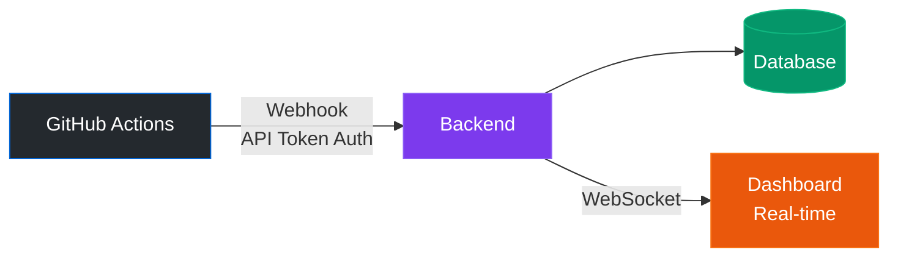

# Full API Token System & Real-Time Updates Implementation Summary

## ✅ Implementation Complete

### What Was Implemented:

#### 1. **Full API Token System** (Database-Backed)
- ✅ `APIToken` model with secure token generation (SHA-256 hashing)
- ✅ Database migration for `api_tokens` table
- ✅ Token management API endpoints:
  - `POST /api/auth/api-tokens` - Create new token (Admin only)
  - `GET /api/auth/api-tokens` - List all tokens (Admin only)
  - `POST /api/auth/api-tokens/<id>/revoke` - Revoke token (Admin only)
- ✅ Webhook authentication middleware (`webhook_auth_required`)
- ✅ Token features:
  - Secure token generation with `sent_` prefix
  - SHA-256 hashing (never stored in plaintext)
  - Expiration dates (optional)
  - Scope-based permissions (`webhook:write`, `webhook:read`)
  - Last used tracking
  - Revocation capability

#### 2. **Real-Time WebSocket Updates**
- ✅ Flask-SocketIO backend integration
- ✅ WebSocket handlers for:
  - Dashboard updates (all clients)
  - Scan-specific updates (per run_id)
  - Connection management
- ✅ Frontend WebSocket service (`websocket.js`)
- ✅ Dashboard integration with real-time updates
- ✅ Nginx WebSocket proxy configuration

#### 3. **GitHub Actions Webhook Integration**
- ✅ Webhook endpoint: `POST /api/cicd/webhook/<scan_type>`
- ✅ Supports scan types: `sonarqube`, `zap`, `trivy`, `lint`, `test`
- ✅ GitHub Actions workflow updated to send results:
  - SonarQube scan results
  - Trivy scan results
  - ZAP scan results
- ✅ Automatic CI/CD run creation/update
- ✅ Real-time WebSocket broadcasts on scan completion

---

## How It Works

### Flow Diagram:



### Step-by-Step:

1. **Admin Creates API Token:**
   ```bash
   POST /api/auth/api-tokens
   Authorization: Bearer <admin_jwt>
   {
     "name": "GitHub Actions CI/CD",
     "expires_in_days": 365,
     "scopes": ["webhook:write"]
   }
   ```
   Response includes token: `sent_abc123xyz...` (shown only once!)

2. **Add Token to GitHub Secrets:**
   - Go to GitHub repo → Settings → Secrets → Actions
   - Add `SENTINAL_API_TOKEN` = `sent_abc123xyz...`
   - Add `SENTINAL_API_URL` = `https://your-api.com` (or `http://localhost/api`)

3. **GitHub Actions Sends Results:**
   ```yaml
   - name: Send Results to Dashboard
     run: |
       curl -X POST "${{ secrets.SENTINAL_API_URL }}/api/cicd/webhook/sonarqube" \
         -H "Authorization: Bearer ${{ secrets.SENTINAL_API_TOKEN }}" \
         -d '{...}'
   ```

4. **Backend Processes Webhook:**
   - Validates API token
   - Creates/updates CI/CD run
   - Stores scan results
   - Emits WebSocket update

5. **Dashboard Receives Real-Time Update:**
   - WebSocket connection established on page load
   - Dashboard subscribes to updates
   - UI updates instantly when scan completes

---

## API Endpoints

### Token Management:
- `POST /api/auth/api-tokens` - Create token (Admin)
- `GET /api/auth/api-tokens` - List tokens (Admin)
- `POST /api/auth/api-tokens/<id>/revoke` - Revoke token (Admin)

### Webhooks:
- `POST /api/cicd/webhook/sonarqube` - SonarQube results
- `POST /api/cicd/webhook/zap` - ZAP results
- `POST /api/cicd/webhook/trivy` - Trivy results
- `POST /api/cicd/webhook/lint` - Linting results
- `POST /api/cicd/webhook/test` - Test results

**Webhook Payload Format:**
```json
{
  "commit_hash": "abc123...",
  "branch": "main",
  "run_id": 123,  // Optional
  "status": "completed",
  "results": {
    "status": "completed",
    "scan_type": "sonarqube",
    "critical": 0,
    "high": 0,
    "medium": 5,
    "low": 10,
    "total": 15,
    "issues": [...]
  }
}
```

---

## WebSocket Events

### Client → Server:
- `subscribe_dashboard` - Subscribe to dashboard updates
- `subscribe_scan` - Subscribe to specific scan updates
- `unsubscribe_scan` - Unsubscribe from scan updates

### Server → Client:
- `connected` - Connection established
- `dashboard_update` - Dashboard update (new_run, scan_completed)
- `scan_update` - Scan-specific update (progress, completed, failed)

**Dashboard Update Example:**
```json
{
  "type": "scan_completed",
  "data": {
    "id": 123,
    "commit_hash": "abc123",
    "status": "Success",
    "critical_vulnerabilities": 0,
    ...
  }
}
```

---

## Setup Instructions

### 1. Run Database Migration:
```bash
docker compose exec backend flask db upgrade
```

### 2. Create API Token (via API):
```bash
# Login as Admin first
curl -X POST http://localhost/api/auth/api-tokens \
  -H "Authorization: Bearer <admin_jwt>" \
  -H "Content-Type: application/json" \
  -d '{
    "name": "GitHub Actions CI/CD",
    "expires_in_days": 365,
    "scopes": ["webhook:write"]
  }'
```

### 3. Add to GitHub Secrets:
- `SENTINAL_API_TOKEN` = token from step 2
- `SENTINAL_API_URL` = your API URL

### 4. Rebuild Containers:
```bash
docker compose down
docker compose build
docker compose up -d
```

---

## Real-Time Features

✅ **Zero Delay Updates:**
- WebSocket connection established immediately
- Updates broadcast instantly when scans complete
- No polling needed

✅ **Automatic Reconnection:**
- WebSocket automatically reconnects on disconnect
- Handles network interruptions gracefully

✅ **Room-Based Updates:**
- Dashboard room: All dashboard updates
- Scan rooms: Per-run updates for detailed views

---

## Security Features

✅ **Token Security:**
- SHA-256 hashing (never plaintext)
- Token prefix only shown in UI
- Expiration dates
- Revocation capability
- Scope-based permissions

✅ **Webhook Security:**
- API token authentication required
- Rate limiting (via Flask-Limiter)
- Input validation
- Error handling

---

## Testing

### Test Webhook Locally:
```bash
curl -X POST http://localhost/api/cicd/webhook/sonarqube \
  -H "Authorization: Bearer <your_api_token>" \
  -H "Content-Type: application/json" \
  -d '{
    "commit_hash": "test123",
    "branch": "main",
    "status": "completed",
    "results": {
      "status": "completed",
      "scan_type": "sonarqube",
      "critical": 0,
      "total": 5
    }
  }'
```

### Check WebSocket Connection:
1. Open browser DevTools → Network → WS
2. Look for `/socket.io` connection
3. Check console for "WebSocket connected" message

---

## Next Steps

1. **Create Admin User** (if not exists):
   ```python
   # Via Flask shell
   from app import db
   from app.models.user import User
   from app.core.security import hash_password
   
   admin = User(
       username='admin',
       email='admin@example.com',
       password_hash=hash_password('secure_password'),
       role='Admin'
   )
   db.session.add(admin)
   db.session.commit()
   ```

2. **Test Full Flow:**
   - Create API token
   - Add to GitHub Secrets
   - Push code to trigger CI/CD
   - Watch dashboard update in real-time

3. **Enhance Scan Results:**
   - Parse actual SonarQube/ZAP/Trivy results
   - Store detailed vulnerability data
   - Display in dedicated result pages

---

## Files Created/Modified

### Backend:
- `backend/app/models/api_token.py` (new)
- `backend/app/core/webhook_auth.py` (new)
- `backend/app/api/api_tokens.py` (new)
- `backend/app/api/websocket.py` (new)
- `backend/app/api/cicd.py` (updated - webhook endpoint)
- `backend/app/__init__.py` (updated - SocketIO init)
- `backend/run.py` (updated - socketio.run)
- `backend/requirements.txt` (updated - Flask-SocketIO)
- `backend/migrations/versions/002_add_api_tokens.py` (new)

### Frontend:
- `frontend/src/services/websocket.js` (new)
- `frontend/src/pages/Dashboard.jsx` (updated - WebSocket integration)
- `frontend/package.json` (updated - socket.io-client)
- `frontend/nginx.conf` (updated - WebSocket proxy)

### CI/CD:
- `.github/workflows/ci-cd.yml` (updated - webhook steps)

---

## Troubleshooting

### WebSocket Not Connecting:
1. Check nginx logs: `docker compose logs frontend`
2. Check backend logs: `docker compose logs backend`
3. Verify WebSocket proxy in nginx.conf
4. Check browser console for errors

### Webhook Returns 401:
1. Verify API token is correct
2. Check token is active: `GET /api/auth/api-tokens`
3. Verify token has `webhook:write` scope
4. Check token expiration date

### Real-Time Updates Not Showing:
1. Check WebSocket connection status in browser DevTools
2. Verify dashboard subscription: `wsService.emit('subscribe_dashboard')`
3. Check backend logs for WebSocket events
4. Verify scan results are being sent correctly

---

## Performance Notes

- WebSocket uses eventlet async mode for better performance
- Updates are broadcast only to subscribed clients
- Database queries are optimized with indexes
- Rate limiting prevents abuse

---

**Implementation Status: ✅ COMPLETE**

All features are implemented and ready for testing. The system provides:
- ✅ Full API token management
- ✅ Secure webhook authentication
- ✅ Real-time WebSocket updates
- ✅ Zero-delay dashboard updates
- ✅ GitHub Actions integration

