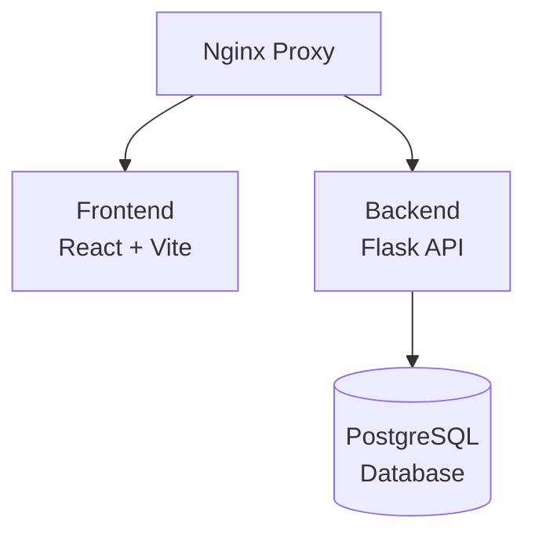

# Project Sentinel - Architecture Documentation

## System Architecture

Project Sentinel follows a microservices-oriented architecture with clear separation between frontend, backend, and infrastructure components.

### High-Level Architecture

### Component Overview

#### Frontend (React + Vite)
- **Technology**: React 19, Vite 7
- **State Management**: Zustand
- **Routing**: React Router v6
- **Styling**: Tailwind CSS
- **Port**: 80 (via Nginx)

#### Backend (Flask)
- **Technology**: Flask 3.0, Flask-RESTful
- **Database ORM**: SQLAlchemy
- **Authentication**: JWT + GitHub OAuth
- **Port**: 5000

#### Database (PostgreSQL)
- **Version**: PostgreSQL 15
- **Port**: 5432
- **Migrations**: Alembic

#### Security Tools
- **Trivy**: Container scanning (Port 8080)
- **OWASP ZAP**: DAST scanning (Port 8080)
- **SonarQube**: SAST scanning (Port 9000)

## API Architecture

### RESTful API Design
- Base URL: `/api`
- Authentication: JWT Bearer tokens
- Response Format: JSON
- Error Handling: Standard HTTP status codes

### Endpoint Categories

1. **Authentication** (`/api/auth/*`)
   - Registration, Login, OAuth, Token Refresh

2. **Threat Modeling** (`/api/threats/*`)
   - Threat analysis, STRIDE/DREAD calculations

3. **Requirements** (`/api/requirements/*`)
   - CRUD operations, Security controls, Compliance

4. **CI/CD** (`/api/cicd/*`)
   - Pipeline runs, Scan results, Dashboard data

## Database Schema

### Tables

1. **users**
   - User accounts and authentication
   - Roles: Admin, Developer

2. **requirements**
   - Functional requirements with security controls
   - JSONB for flexible security control storage

3. **security_controls**
   - Individual security controls linked to requirements

4. **threats**
   - Threat modeling results
   - STRIDE categories and DREAD scores

5. **ci_cd_runs**
   - Pipeline execution history
   - Scan results storage

## Security Architecture

### Authentication Flow
1. User authenticates (JWT or GitHub OAuth)
2. Backend issues access and refresh tokens
3. Frontend stores tokens securely
4. API requests include Bearer token
5. Backend validates token on each request

### Authorization
- Role-based access control (RBAC)
- Admin vs Developer permissions
- Protected routes on frontend
- API endpoint authorization middleware

### Security Measures
- Input validation (marshmallow schemas)
- Output encoding (XSS prevention)
- SQL injection prevention (SQLAlchemy)
- CSRF protection
- Rate limiting
- Security headers (CSP, HSTS)

## Deployment Architecture

### Docker Compose Setup
- All services containerized
- Nginx as reverse proxy
- Volume mounts for persistence
- Health checks for services

### CI/CD Pipeline
1. Linting (ESLint, flake8, bandit)
2. Testing (Jest, PyTest)
3. Build (Docker images)
4. Security Scans (SAST, DAST, Container)
5. Deployment Gate
6. Production Deployment

## Scalability Considerations

- Stateless backend (horizontal scaling)
- Database connection pooling
- Frontend CDN-ready
- Microservices-ready architecture
- Load balancer compatible

