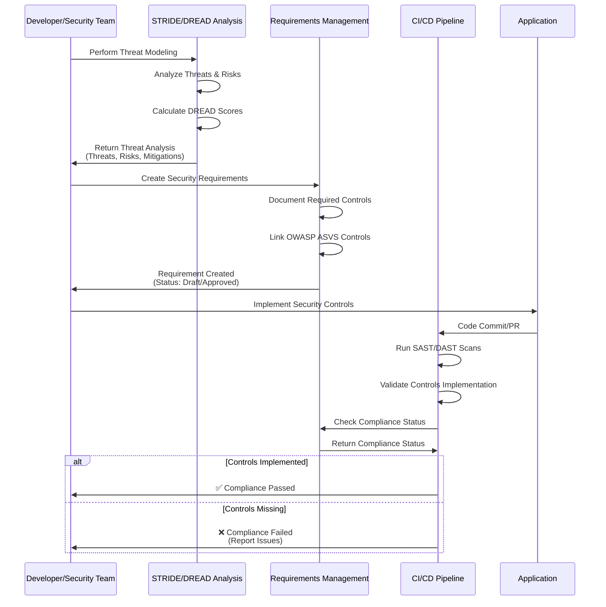

# Testing Guide: API Tokens & Requirements Management

## Part 1: API Tokens - Purpose & Testing

### What Are API Tokens?

API tokens in Sentinal are **secure credentials** that allow external services (like GitHub Actions CI/CD pipelines) to authenticate and send data to your Sentinal dashboard **without using your personal user account**.

### Purpose of API Tokens:

1. **Webhook Authentication**: Allow GitHub Actions to securely send scan results (SAST, DAST, Container Scans) to Sentinal
2. **Automated Integrations**: Enable scripts and tools to programmatically interact with Sentinal
3. **Granular Permissions**: Tokens have scopes (like `webhook:write`) to limit what they can do
4. **Security**: Can be revoked instantly if compromised, without affecting user accounts
5. **Tracking**: Monitor when and how tokens are used via `last_used_at` field

### How to Test API Token Creation:

#### Step 1: Access Sentinal Frontend
```bash
# Ensure containers are running
docker compose --env-file .docker.env ps

# Access frontend at:
# http://localhost
```

#### Step 2: Create an API Token via UI

1. **Login** as an Admin user
2. Click **"API Tokens"** in the left sidebar
3. Click **"+ Create Token"** button
4. Fill in the form:
   - **Token Name**: `GitHub Actions Test Token`
   - **Expires In (Days)**: `30` (or leave empty for no expiration)
   - **Scopes**: Check `webhook:write`
5. Click **"Create Token"**
6. **IMPORTANT**: Copy the full token immediately (shown only once!)
   - Format: `sent_abc123xyz...` (starts with `sent_` prefix)

#### Step 3: Test Token Authentication with curl

Replace `<YOUR_API_TOKEN>` with the token you copied:

```bash
# Test 1: Verify token works with a simple webhook call
curl -X POST http://localhost/api/cicd/webhook/sast \
  -H "Content-Type: application/json" \
  -H "X-API-Token: <YOUR_API_TOKEN>" \
  -d '{
    "repository": "test-repo",
    "branch": "main",
    "commit_hash": "a1b2c3d4e5f6",
    "scan_type": "sast",
    "status": "completed",
    "results": {
      "findings": [
        {
          "rule": "SQL Injection",
          "severity": "High",
          "file": "app.py",
          "line": 42
        }
      ]
    }
  }'
```

**Expected Response:**
- `200 OK` or `201 Created` = Token is valid ✅
- `401 Unauthorized` = Token is invalid/expired ❌
- `403 Forbidden` = Token lacks required scopes ❌

#### Step 4: Verify Token Usage

1. Go back to **API Tokens** page in Sentinal
2. Check your token - the **"Last Used At"** timestamp should be updated
3. Go to **Dashboard** - you should see a new CI/CD run if the webhook was processed

#### Step 5: Test Token Revocation

1. On the API Tokens page, find your test token
2. Click **"Revoke"** (or similar button)
3. Try the curl command again - should now return `401 Unauthorized`

### Testing via API Directly:

```bash
# First, get your JWT token (login)
JWT_TOKEN=$(curl -X POST http://localhost/api/auth/login \
  -H "Content-Type: application/json" \
  -d '{"username":"your_admin_username","password":"your_password"}' \
  | jq -r '.access_token')

# Create API token
curl -X POST http://localhost/api/auth/api-tokens \
  -H "Authorization: Bearer $JWT_TOKEN" \
  -H "Content-Type: application/json" \
  -d '{
    "name": "Test Token",
    "expires_in_days": 30,
    "scopes": ["webhook:write"]
  }'

# Response will include the full token - save it!
```

---

## Part 2: Requirements Management - Overview & Purpose

### What is Requirements Management?

**Requirements Management** is a feature for documenting and tracking **security requirements** and their associated **security controls**. It's based on **OWASP ASVS (Application Security Verification Standard)** and helps you:

- Document security requirements your application must meet
- Link security controls to requirements
- Track compliance status
- Export requirements for audits

### How Does It Relate to STRIDE/DREAD?

**Requirements Management** is **complementary** to STRIDE/DREAD but serves a different purpose:

| Feature | Purpose | When to Use |
|---------|---------|-------------|
| **STRIDE/DREAD** | **Threat Modeling** - Identify and assess security threats | During design phase, threat analysis |
| **Requirements Management** | **Compliance Tracking** - Document security requirements and controls | Throughout development, compliance audits |

### Relationship Flow:



**Example Workflow:**

1. **Threat Modeling** (STRIDE/DREAD):
   - Identify threat: "SQL Injection in API endpoint"
   - DREAD Score: High risk
   - Mitigation: "Use parameterized queries"

2. **Requirements Management**:
   - Create requirement: "All database queries must use parameterized statements"
   - Add control: "OWASP ASVS Level 1 - V5.2.1: Parameterized Queries"
   - Status: "Implemented"

3. **CI/CD Pipeline**:
   - SAST scan checks for SQL injection vulnerabilities
   - Validates that parameterized queries are used
   - Reports compliance status

### How to Test Requirements Management:

#### Step 1: Create a Security Requirement

1. Go to **"Requirements"** page in Sentinal
2. Click **"New Requirement"**
3. Fill in:
   - **Title**: `Prevent SQL Injection Attacks`
   - **Description**: `All database queries must use parameterized statements to prevent SQL injection`
   - **Status**: `Draft` → `Review` → `Approved` → `Implemented`
   - **OWASP ASVS Level**: `Level 1` (or Level 2, Level 3)
   - **Security Controls**: Click "Add Control"
     - **Control Name**: `Use Parameterized Queries`
     - **Description**: `All SQL queries must use parameterized/prepared statements`
     - **OWASP ASVS Level**: `Level 1`

4. Click **"Create"**

#### Step 2: View Compliance Dashboard (Admin Only)

If you're an Admin, you'll see:
- **Total Requirements**: Count of all requirements
- **With Controls**: Requirements that have security controls linked
- **Compliance Rate**: Percentage of requirements with controls

#### Step 3: Export Requirements

1. Click **"Export JSON"** or **"Export CSV"**
2. Download the file
3. Use for audits or documentation

#### Step 4: Link Requirements to Threats (Future Feature)

Currently, Requirements Management is separate from Threat Modeling, but the architecture supports linking them. In the future, you could:
- Link threats to requirements
- Track which requirements address which threats
- Generate compliance reports showing threat coverage

### Example Use Cases:

#### Use Case 1: OWASP ASVS Compliance

```
Requirement: "Authentication Requirements"
Controls:
  - V2.1.1: Verify all authentication functions are implemented securely
  - V2.1.2: Verify passwords are hashed using strong algorithms
  - V2.1.3: Verify multi-factor authentication is implemented
Status: Implemented
```

#### Use Case 2: PCI DSS Compliance

```
Requirement: "Protect Cardholder Data"
Controls:
  - Encrypt cardholder data in transit
  - Encrypt cardholder data at rest
  - Implement access controls
Status: Review
```

#### Use Case 3: GDPR Compliance

```
Requirement: "Data Protection Requirements"
Controls:
  - Implement data encryption
  - Implement access logging
  - Implement data retention policies
Status: Approved
```

### Testing Requirements Management via API:

```bash
# Get JWT token first
JWT_TOKEN=$(curl -X POST http://localhost/api/auth/login \
  -H "Content-Type: application/json" \
  -d '{"username":"admin","password":"password"}' \
  | jq -r '.access_token')

# Create a requirement
curl -X POST http://localhost/api/requirements \
  -H "Authorization: Bearer $JWT_TOKEN" \
  -H "Content-Type: application/json" \
  -d '{
    "title": "Prevent SQL Injection",
    "description": "All database queries must use parameterized statements",
    "status": "Draft",
    "owasp_asvs_level": "Level 1",
    "security_controls": [
      {
        "name": "Use Parameterized Queries",
        "description": "All SQL queries must use parameterized/prepared statements",
        "owasp_asvs_level": "Level 1"
      }
    ]
  }'

# List all requirements
curl -X GET http://localhost/api/requirements \
  -H "Authorization: Bearer $JWT_TOKEN"

# Get compliance dashboard (Admin only)
curl -X GET http://localhost/api/requirements/compliance \
  -H "Authorization: Bearer $JWT_TOKEN"

# Export requirements as JSON
curl -X GET "http://localhost/api/requirements/export?format=json" \
  -H "Authorization: Bearer $JWT_TOKEN"

# Export requirements as CSV
curl -X GET "http://localhost/api/requirements/export?format=csv" \
  -H "Authorization: Bearer $JWT_TOKEN"
```

---

## Summary

### API Tokens:
- **Purpose**: Secure authentication for external services (CI/CD pipelines)
- **Testing**: Create token → Use in webhook calls → Verify usage tracking
- **Related to**: CI/CD Pipeline integration

### Requirements Management:
- **Purpose**: Document security requirements and track compliance
- **Testing**: Create requirements → Add controls → View compliance dashboard
- **Related to**: Compliance (OWASP ASVS), Security Standards, Audits
- **Complementary to**: STRIDE/DREAD (threats → requirements → controls)

Both features work together to provide a complete DevSecOps workflow:
1. **STRIDE/DREAD** identifies threats
2. **Requirements Management** documents required controls
3. **CI/CD Pipeline** validates controls are implemented
4. **API Tokens** enable secure integration between systems

