# Project Sentinel - Comprehensive Technical Report

## Executive Summary

Project Sentinel is a comprehensive DevSecOps platform that integrates Security-by-Design principles into every stage of the Software Development Lifecycle (SDLC). The platform provides automated threat modeling using STRIDE/DREAD methodologies, security requirements management aligned with OWASP ASVS, and integrated CI/CD security scanning with SAST, DAST, and container scanning capabilities.

---

## 1. Problem Statement

### 1.1 The Challenge

Modern software development faces critical security challenges:

1. **Security as an Afterthought**: Traditional development processes treat security as a bolt-on feature, leading to vulnerabilities discovered late in the development cycle when remediation is costly and time-consuming.

2. **Lack of Integrated Security Tools**: Development teams struggle with fragmented security tools that don't integrate seamlessly into their workflows, creating gaps in security coverage.

3. **Manual Threat Modeling**: Threat modeling is often performed manually, inconsistently, and without proper documentation, making it difficult to track and mitigate security risks systematically.

4. **Disconnected Security Requirements**: Security requirements are often managed separately from functional requirements, leading to misalignment and incomplete security coverage.

5. **Limited CI/CD Security Integration**: Security scanning tools (SAST, DAST, container scanning) operate in isolation, making it difficult to correlate findings and prioritize remediation efforts.

6. **Insufficient Security Visibility**: Development teams lack real-time visibility into security posture, threat trends, and compliance status.

### 1.2 Relevance to Secure Software Design

This problem is directly relevant to secure software design because:

- **Security-by-Design Principle**: Security must be integrated from the requirements phase, not added later. Project Sentinel addresses this by providing threat modeling and security requirements management from the start.

- **Defense in Depth**: The platform implements multiple layers of security controls (authentication, authorization, input validation, security scanning) at different stages of the SDLC.

- **Continuous Security**: Security is not a one-time activity but a continuous process integrated into every stage of development, testing, and deployment.

- **Risk-Based Approach**: The platform enables risk-based prioritization through automated DREAD scoring, helping teams focus on high-risk threats first.

- **Compliance Alignment**: The system aligns with industry standards (OWASP ASVS, GDPR) to ensure compliance and best practices.

### 1.3 Project Objectives

The project objectives are clear, achievable, and measurable:

1. **Automated Threat Modeling**: Provide intelligent STRIDE/DREAD analysis with pattern recognition and automated scoring to reduce manual effort and improve consistency.

2. **Integrated Security Requirements Management**: Enable seamless mapping of security controls to functional requirements with compliance tracking.

3. **CI/CD Security Integration**: Integrate SAST (SonarQube), DAST (OWASP ZAP), and container scanning (Trivy) into CI/CD pipelines with real-time visibility.

4. **Real-Time Security Visibility**: Provide dashboards, analytics, and WebSocket-based real-time updates for security events and scan results.

5. **Developer-Friendly Interface**: Create an intuitive, modern web interface that makes security accessible to developers without requiring deep security expertise.

6. **Scalable Architecture**: Design a microservices-oriented architecture that can scale and integrate with existing development workflows.

---

## 2. Proposed Solution & Architecture

### 2.1 System Overview

Project Sentinel is a full-stack web application consisting of:

- **Frontend**: React-based single-page application providing intuitive UI for threat modeling, requirements management, and CI/CD dashboards
- **Backend**: RESTful API built with Flask providing threat analysis, requirements management, and CI/CD integration services
- **Database**: PostgreSQL database storing users, threats, requirements, and CI/CD run data
- **Security Tools**: Integrated SonarQube (SAST), OWASP ZAP (DAST), and Trivy (container scanning)
- **Infrastructure**: Docker containerization with Nginx reverse proxy for production deployment

### 2.2 High-Level Architecture

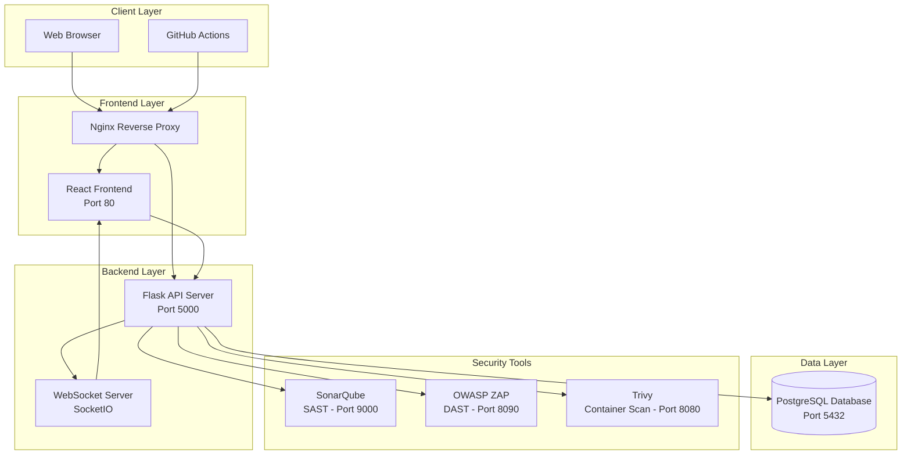

### 2.3 Component Architecture

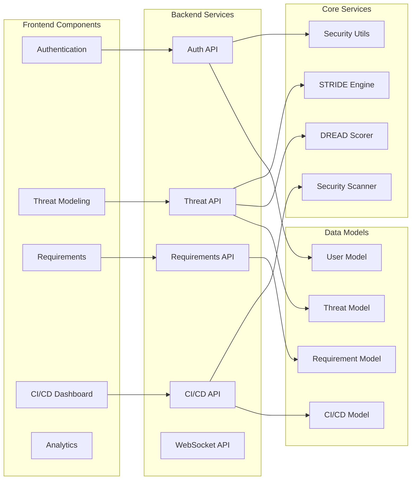

### 2.4 Technology Stack

| Layer | Technology | Purpose |
|-------|-----------|---------|
| **Frontend** | React 19, Vite 7 | Modern UI framework with fast build |
| **State Management** | Zustand | Lightweight state management |
| **Styling** | Tailwind CSS | Utility-first CSS framework |
| **Visualization** | ReactFlow, Recharts | Interactive diagrams and charts |
| **Backend** | Flask 3.0, Flask-RESTful | RESTful API framework |
| **Database** | PostgreSQL 15 | Relational database with JSONB support |
| **ORM** | SQLAlchemy | Database abstraction layer |
| **Authentication** | Flask-JWT-Extended | JWT-based authentication |
| **Real-time** | Flask-SocketIO | WebSocket support |
| **Security** | Flask-Talisman, Flask-Limiter | Security headers and rate limiting |
| **Containerization** | Docker, Docker Compose | Container orchestration |
| **CI/CD** | GitHub Actions | Automated testing and deployment |

### 2.5 Database Schema

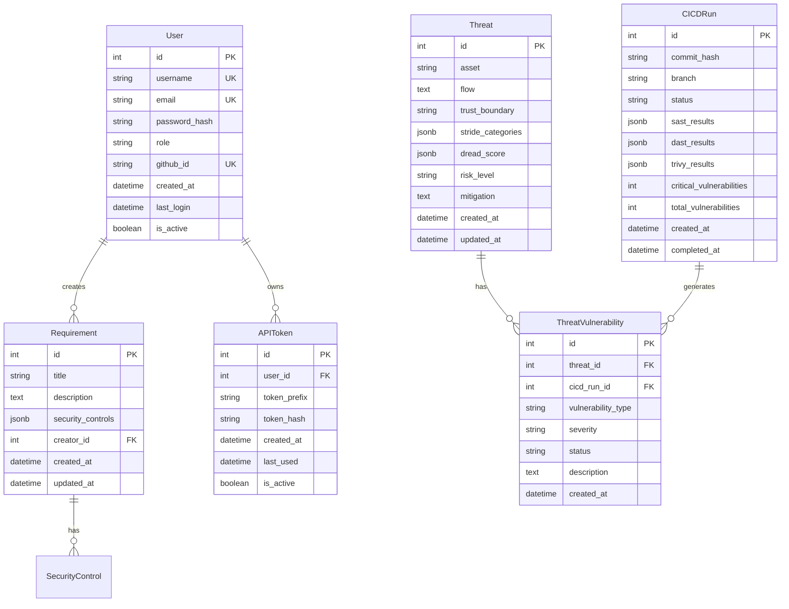

---

## 3. Methodology & SDLC Coverage

### 3.1 Development Approach

Project Sentinel follows an **Agile/Iterative development methodology** with Security-by-Design principles integrated at every stage. The development approach emphasizes:

- **Incremental Development**: Features are developed in iterations, allowing for continuous feedback and improvement
- **Test-Driven Development**: Comprehensive test coverage with unit tests, integration tests, and end-to-end tests
- **Continuous Integration**: Automated testing, linting, and security scanning on every commit
- **Documentation-Driven**: Technical documentation, API documentation, and user guides maintained alongside code

### 3.2 Security Activities Integrated at Each SDLC Stage

#### 3.2.1 Requirements Phase

**Security Activities:**

1. **Security Requirements Gathering**
   - System provides structured templates for security requirements
   - OWASP ASVS alignment for compliance tracking
   - One-to-one mapping of security controls to functional requirements

2. **Threat Modeling Initiation**
   - Early threat identification using STRIDE methodology
   - Asset identification and data flow mapping
   - Trust boundary definition

3. **Compliance Requirements**
   - GDPR compliance features (data retention, user rights)
   - OWASP ASVS compliance tracking
   - Security control mapping

**Implementation in Project Sentinel:**

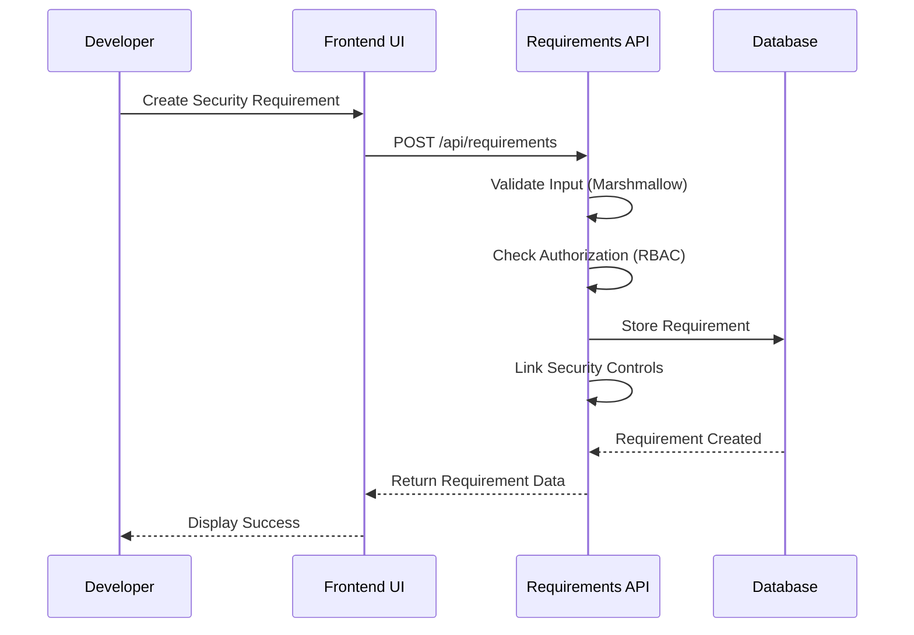

**Key Features:**
- `/api/requirements` endpoint for CRUD operations
- Security control validation and mapping
- Compliance dashboard for tracking OWASP ASVS alignment
- Export functionality (CSV/JSON) for audit purposes

#### 3.2.2 Design Phase

**Security Activities:**

1. **Security Architecture Design**
   - Authentication and authorization design (JWT, OAuth)
   - Data encryption and secure storage
   - API security (rate limiting, input validation)

2. **Threat Modeling Refinement**
   - Advanced STRIDE analysis with pattern recognition
   - Automated DREAD scoring for risk assessment
   - Mitigation strategy development

3. **Security Control Design**
   - Input validation schemas
   - Output encoding mechanisms
   - Security headers configuration

**Implementation in Project Sentinel:**

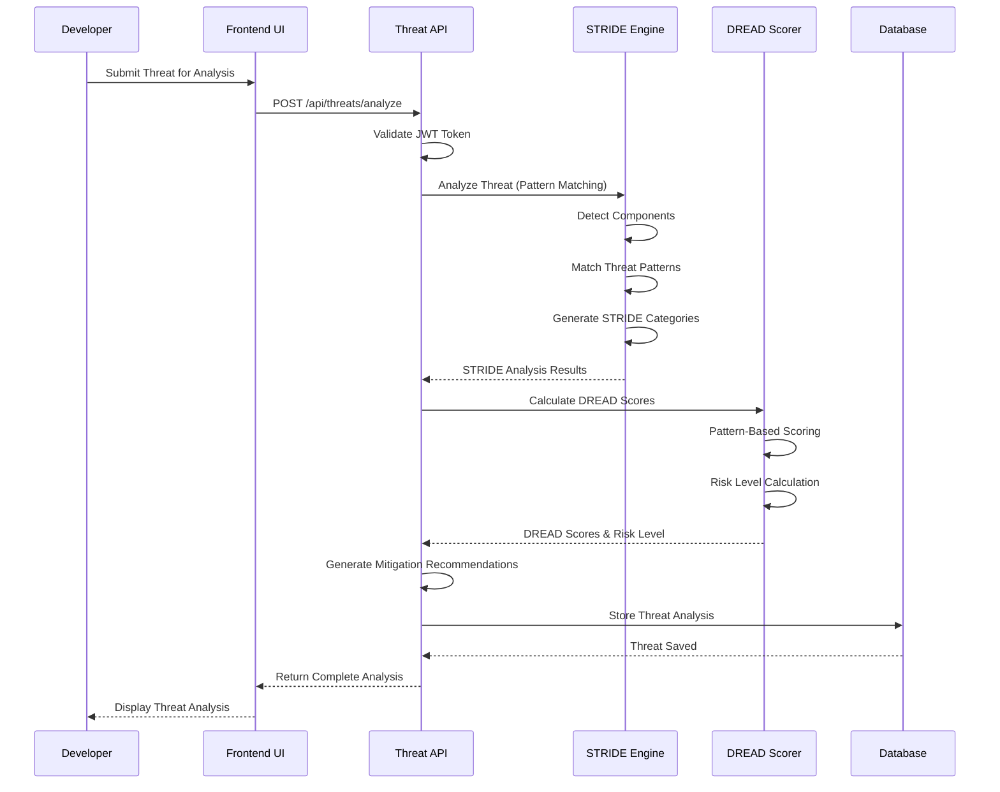

**Key Features:**
- Advanced pattern recognition with 14 threat patterns
- Component detection (API, database, authentication, etc.)
- Automated DREAD scoring with confidence indicators
- Enhanced mitigation recommendations
- Threat similarity detection for learning

#### 3.2.3 Coding Phase

**Security Activities:**

1. **Secure Coding Practices**
   - Input validation using Marshmallow schemas
   - SQL injection prevention with SQLAlchemy ORM
   - XSS prevention with output encoding
   - Secure password hashing (bcrypt)

2. **Static Analysis (SAST)**
   - SonarQube integration for code quality and security
   - Automated vulnerability detection
   - Code smell identification

3. **Dependency Scanning**
   - Trivy integration for container and dependency scanning
   - Known vulnerability detection
   - License compliance checking

**Implementation in Project Sentinel:**

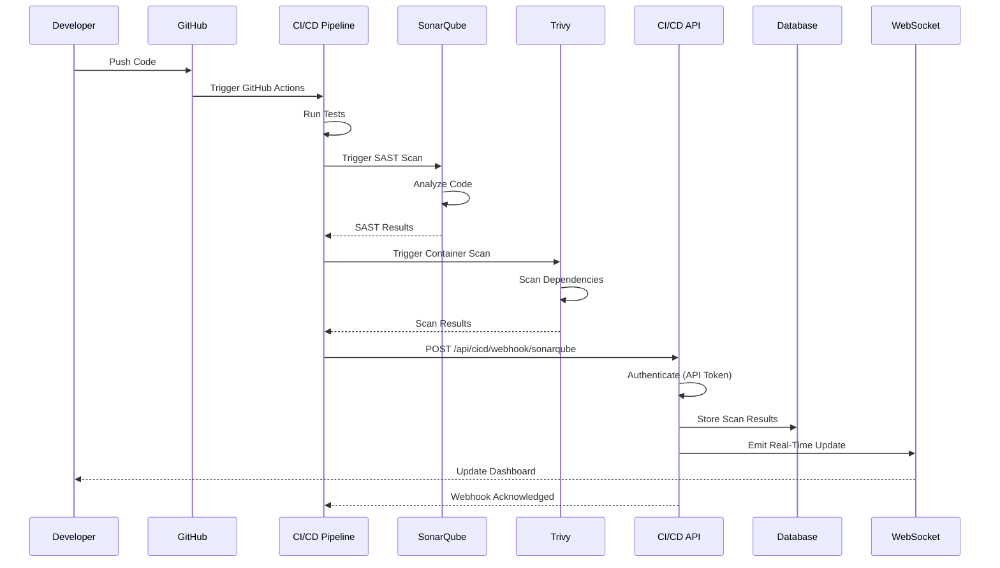

**Key Features:**
- Automated SAST scanning with SonarQube
- Container and dependency scanning with Trivy
- Webhook integration for GitHub Actions
- Real-time scan result updates via WebSocket
- Vulnerability correlation with threat models

#### 3.2.4 Testing Phase

**Security Activities:**

1. **Security Testing**
   - Dynamic Application Security Testing (DAST) with OWASP ZAP
   - Penetration testing support
   - Vulnerability scanning

2. **Integration Testing**
   - API endpoint testing
   - Authentication and authorization testing
   - Security control validation

3. **Automated Test Suite**
   - Unit tests for security functions
   - Integration tests for API endpoints
   - End-to-end tests for critical flows

**Implementation in Project Sentinel:**

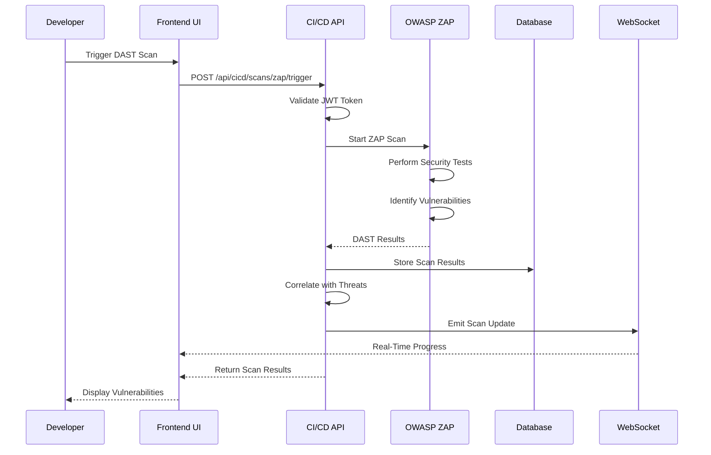

**Key Features:**
- OWASP ZAP integration for DAST scanning
- Automated vulnerability detection
- Real-time scan progress updates
- Vulnerability correlation with threat models
- Comprehensive test coverage (pytest, Jest)

### 3.3 Security Activities Summary by SDLC Stage

| SDLC Stage | Security Activities | Project Sentinel Features |
|------------|---------------------|--------------------------|
| **Requirements** | Security requirements gathering, Threat modeling initiation, Compliance tracking | Requirements API, OWASP ASVS alignment, Threat templates |
| **Design** | Security architecture, Threat modeling refinement, Security control design | STRIDE/DREAD analysis, Pattern recognition, Mitigation recommendations |
| **Coding** | Secure coding practices, SAST, Dependency scanning | SonarQube integration, Trivy scanning, Input validation |
| **Testing** | DAST, Security testing, Vulnerability scanning | OWASP ZAP integration, Automated test suite, Vulnerability correlation |
| **Deployment** | Security scanning in CI/CD, Real-time monitoring | Webhook integration, Real-time dashboards, Security event logging |
| **Maintenance** | Continuous monitoring, Threat updates, Compliance auditing | Analytics dashboard, Threat similarity, Compliance reports |

---

## 4. Data Flow Diagrams

### 4.1 Authentication Flow

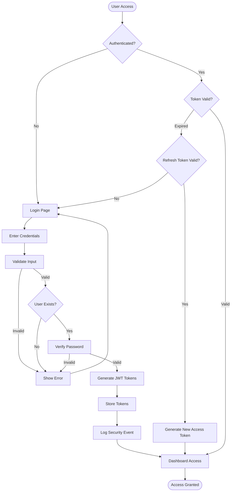

### 4.2 Threat Analysis Data Flow

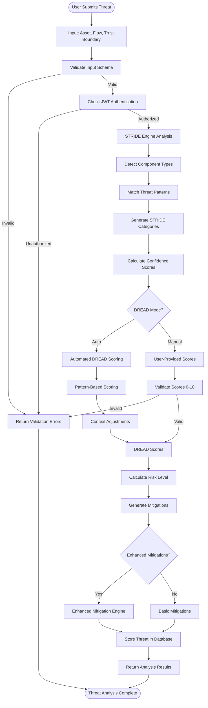

### 4.3 CI/CD Security Scanning Data Flow

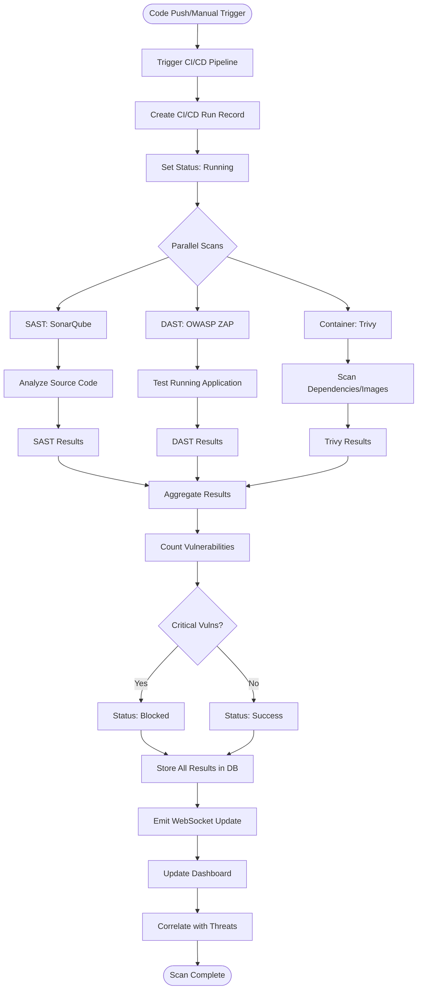

### 4.4 Requirements Management Data Flow

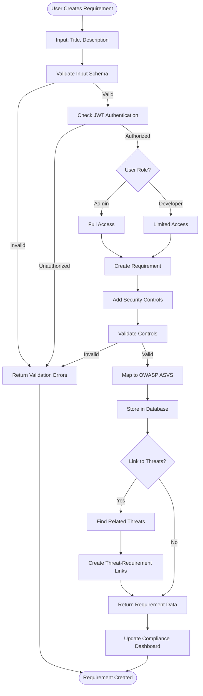

---

## 5. Sequence Diagrams for Normal Flows

### 5.1 User Registration and Login Flow

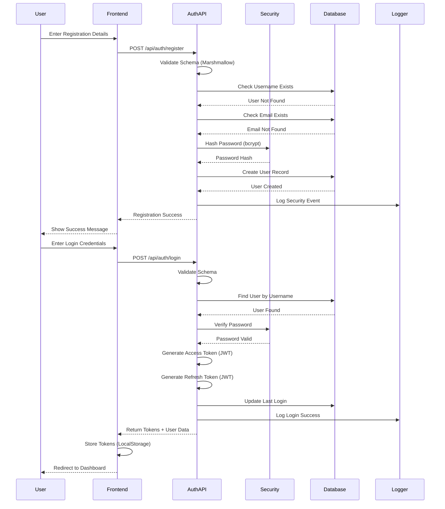

### 5.2 GitHub OAuth Flow

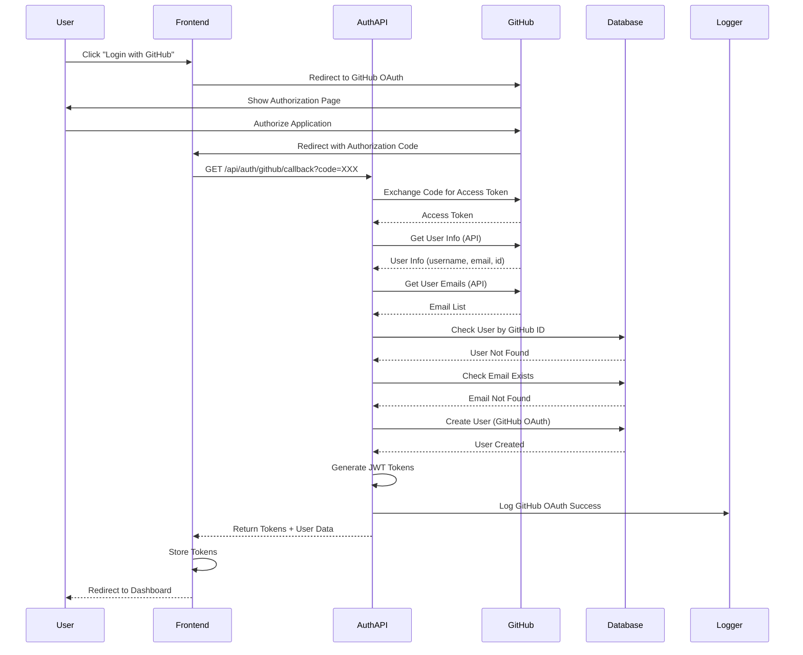

### 5.3 Threat Analysis Flow

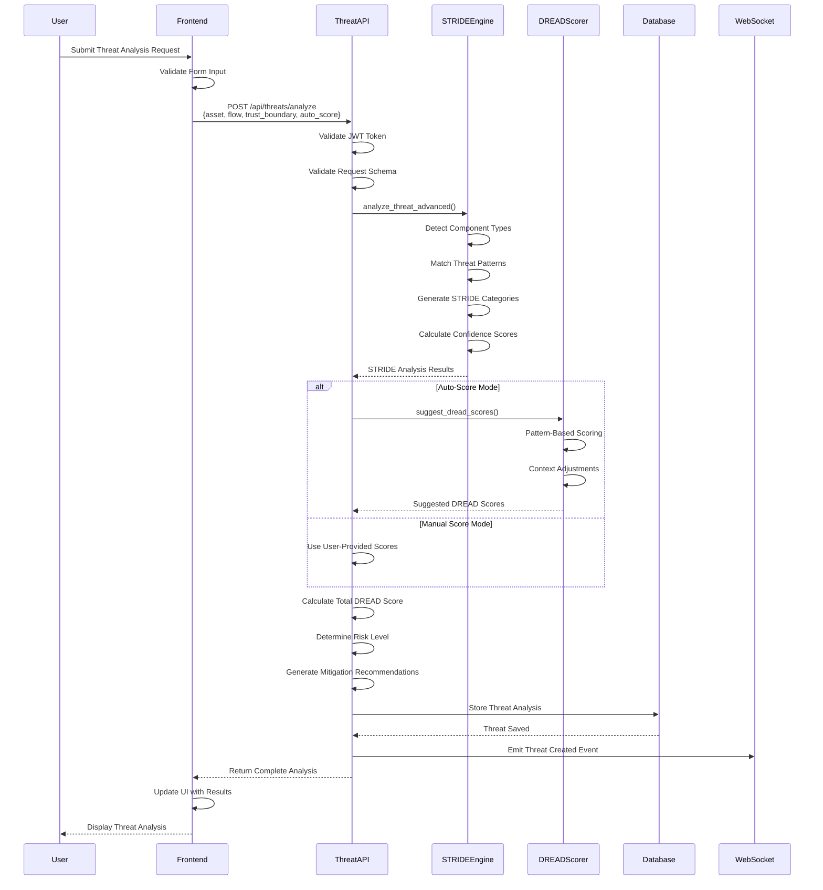

### 5.4 CI/CD Webhook Flow

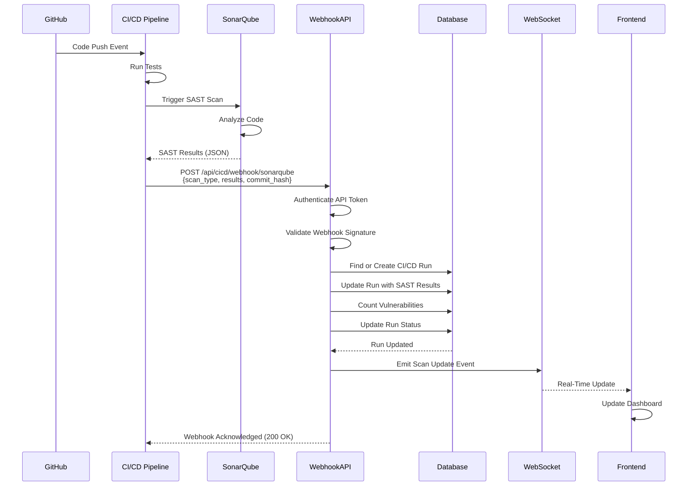

### 5.5 Requirements Creation and Compliance Tracking

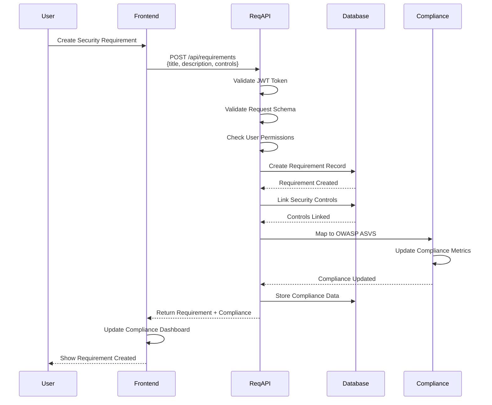

---

## 6. Security Features Implementation

### 6.1 Authentication & Authorization

**JWT-Based Authentication:**
- Access tokens (30-minute expiry)
- Refresh tokens (7-day expiry)
- Secure token storage
- Token refresh mechanism

**Role-Based Access Control (RBAC):**
- Admin role: Full access to all features
- Developer role: Limited access to threat modeling and requirements

**GitHub OAuth Integration:**
- Secure OAuth 2.0 flow
- User account linking
- Automatic user creation

### 6.2 Input Validation & Sanitization

**Backend (Marshmallow):**
- Schema-based validation
- Type checking
- Length validation
- Email validation
- Custom validators

**Frontend (Zod):**
- Client-side validation
- Form validation
- Type safety

**XSS Prevention:**
- Output encoding
- Content Security Policy (CSP)
- Input sanitization

### 6.3 Security Headers

**Flask-Talisman Configuration:**
- Strict Transport Security (HSTS)
- Content Security Policy
- X-Frame-Options
- X-Content-Type-Options
- X-XSS-Protection

### 6.4 Rate Limiting

**Flask-Limiter:**
- Registration: 5 requests per minute
- Login: 10 requests per minute
- API endpoints: Configurable limits
- IP-based rate limiting

### 6.5 Password Security

**bcrypt Hashing:**
- Secure password hashing
- Salt generation
- Cost factor configuration

### 6.6 API Token Management

**Secure API Tokens:**
- Token prefix storage (first 8 characters)
- Hashed token storage
- Token revocation
- Last used tracking
- Admin-only management

### 6.7 Security Event Logging

**Audit Trail:**
- User registration events
- Login success/failure events
- Security-sensitive operations
- IP address tracking
- Timestamp logging

---

## 7. Integration Points

### 7.1 SonarQube Integration (SAST)

- **Purpose**: Static Application Security Testing
- **Integration Method**: REST API
- **Features**:
  - Automated code analysis
  - Vulnerability detection
  - Code quality metrics
  - Security hotspot identification

### 7.2 OWASP ZAP Integration (DAST)

- **Purpose**: Dynamic Application Security Testing
- **Integration Method**: REST API
- **Features**:
  - Automated security testing
  - Vulnerability scanning
  - Active and passive scanning
  - Report generation

### 7.3 Trivy Integration (Container Scanning)

- **Purpose**: Container and dependency vulnerability scanning
- **Integration Method**: REST API
- **Features**:
  - Container image scanning
  - Dependency vulnerability detection
  - License compliance
  - CVE tracking

### 7.4 GitHub Actions Integration

- **Purpose**: CI/CD pipeline integration
- **Integration Method**: Webhooks
- **Features**:
  - Automated scan triggering
  - Real-time result updates
  - Commit hash tracking
  - Branch-based scanning

---

## 8. Compliance & Standards Alignment

### 8.1 OWASP ASVS Alignment

- Security requirements mapped to OWASP ASVS levels
- Compliance dashboard for tracking
- Security control validation
- Audit trail for compliance

### 8.2 GDPR Compliance

- Data retention policies
- User data access rights
- Data minimization principles
- Secure data storage
- Audit logging

### 8.3 Security Best Practices

- Defense in depth
- Least privilege
- Fail securely
- Secure by default
- Complete mediation

---

## 9. Testing Strategy

### 9.1 Backend Testing

- **Unit Tests**: Individual function testing
- **Integration Tests**: API endpoint testing
- **Security Tests**: Authentication, authorization, input validation
- **Coverage**: Comprehensive test coverage with pytest

### 9.2 Frontend Testing

- **Component Tests**: React component testing
- **Integration Tests**: User flow testing
- **E2E Tests**: Critical path testing

### 9.3 CI/CD Testing

- Automated test execution on every commit
- Linting and code quality checks
- Security scanning integration
- Test coverage reporting

---

## 10. Deployment Architecture

### 10.1 Containerization

- **Docker**: Application containerization
- **Docker Compose**: Multi-container orchestration
- **Nginx**: Reverse proxy and load balancing
- **PostgreSQL**: Database container

### 10.2 Production Considerations

- Environment variable configuration
- Secret management
- HTTPS enforcement
- Database backups
- Monitoring and logging

---

## 11. Future Enhancements

1. **Advanced Analytics**: Machine learning for threat prediction
2. **Multi-Tenancy**: Support for multiple organizations
3. **API Rate Limiting**: Advanced rate limiting strategies
4. **Threat Intelligence**: Integration with threat intelligence feeds
5. **Compliance Automation**: Automated compliance reporting
6. **Advanced Visualization**: Enhanced threat modeling diagrams

---

## 12. Conclusion

Project Sentinel successfully addresses the critical need for Security-by-Design in modern software development. By integrating security activities at every stage of the SDLC, the platform provides:

- **Automated Threat Modeling**: Reducing manual effort and improving consistency
- **Integrated Security Requirements**: Ensuring security controls are properly mapped and tracked
- **CI/CD Security Integration**: Providing real-time visibility into security posture
- **Developer-Friendly Interface**: Making security accessible to all team members
- **Compliance Alignment**: Supporting industry standards and regulations

The architecture is scalable, maintainable, and follows security best practices. The comprehensive test coverage and CI/CD integration ensure code quality and security throughout the development lifecycle.

---

## Appendix A: API Endpoints Summary

### Authentication Endpoints
- `POST /api/auth/register` - User registration
- `POST /api/auth/login` - User login
- `GET /api/auth/github` - GitHub OAuth initiation
- `GET /api/auth/github/callback` - GitHub OAuth callback
- `POST /api/auth/refresh` - Token refresh
- `GET /api/auth/profile` - User profile

### Threat Modeling Endpoints
- `POST /api/threats/analyze` - Analyze threat
- `GET /api/threats` - List threats
- `GET /api/threats/{id}` - Get threat details
- `GET /api/threats/analytics` - Threat analytics
- `GET /api/threats/{id}/similar` - Find similar threats

### Requirements Endpoints
- `GET /api/requirements` - List requirements
- `POST /api/requirements` - Create requirement
- `GET /api/requirements/{id}` - Get requirement details
- `GET /api/requirements/compliance` - Compliance dashboard

### CI/CD Endpoints
- `GET /api/cicd/runs` - List CI/CD runs
- `POST /api/cicd/trigger` - Trigger CI/CD run
- `GET /api/cicd/dashboard` - Dashboard statistics
- `POST /api/cicd/webhook/{scan_type}` - Webhook endpoint

---

## Appendix B: Key Configuration Files

- `.docker.env.example` - Environment variable template
- `docker-compose.yml` - Container orchestration
- `backend/.flake8` - Python linting configuration
- `backend/pytest.ini` - Test configuration
- `.github/workflows/ci-cd.yml` - CI/CD pipeline configuration

---

**Document Version**: 1.0  
**Last Updated**: 2024  
**Author**: Project Sentinel Development Team
