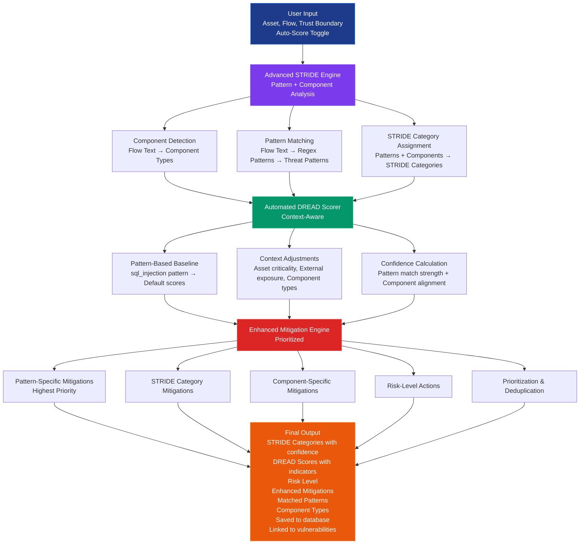
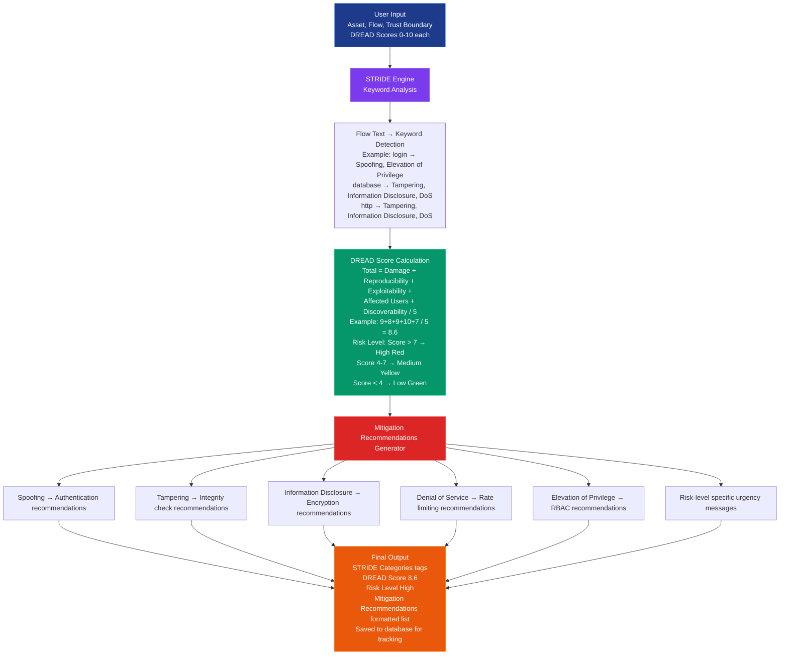

# How STRIDE/DREAD Works in Project Sentinel

## Overview

Project Sentinel uses an **advanced pattern-based STRIDE analysis** combined with **automated DREAD scoring** to identify and assess security threats. The system leverages threat pattern recognition, component detection, and rule-based scoring to provide intelligent threat analysis.

## How It Works - Step by Step

### Step 1: Advanced STRIDE Analysis (Automatic with Pattern Recognition)

The system analyzes your threat description using **advanced pattern matching** and **component detection**:

```python
# Example: User submits threat with this flow:
"User submits login credentials via POST request. Backend queries PostgreSQL database using string concatenation without parameterized queries."

# System performs:
1. Component Detection:
   ✅ Detected: 'api', 'database', 'authentication' components

2. Pattern Matching:
   ✅ Matched: 'sql_injection' pattern (confidence: 0.9)
   ✅ Matched: 'authentication_bypass' pattern (confidence: 0.85)

3. STRIDE Category Assignment:
   ✅ Pattern-based: ['Tampering', 'Information Disclosure', 'Elevation of Privilege']
   ✅ Component-based: ['Spoofing', 'Elevation of Privilege']
   
4. Confidence Scoring:
   ✅ Tampering: 0.9 (high confidence from SQL injection pattern)
   ✅ Information Disclosure: 0.9
   ✅ Elevation of Privilege: 0.88
   ✅ Spoofing: 0.85

# Result: ['Spoofing', 'Tampering', 'Information Disclosure', 'Elevation of Privilege']
# With confidence scores for each category
```

### Step 2: Automated DREAD Scoring (Pattern-Based Suggestions)

The system **automatically suggests** DREAD scores based on threat patterns and context:

```
Pattern Detection: SQL Injection
Asset Type: Database
Component Types: ['api', 'database', 'authentication']

Suggested Scores:
Damage: 9          → High damage potential (data breach, system compromise)
Reproducibility: 8 → Easy to reproduce (can be triggered reliably)
Exploitability: 9  → Easy to exploit (publicly available tools)
Affected Users: 10 → All users affected (critical system)
Discoverability: 7 → Moderate discoverability (requires some investigation)

Confidence Levels:
Damage: 90%         → High confidence (pattern-based)
Reproducibility: 85% → High confidence
Exploitability: 90% → High confidence
Affected Users: 95% → Very high confidence (database component)
Discoverability: 75% → Medium-high confidence

User can:
- Accept all suggestions with one click
- Adjust individual scores using interactive sliders
- Override any score manually
```

### Step 3: Risk Calculation (Automatic)

The system calculates the total DREAD score:

```python
Total Score = (9 + 8 + 9 + 10 + 7) / 5 = 43 / 5 = 8.6

# Risk Level Assignment:
if score > 7:   → "High" risk (Red badge)
elif score > 4: → "Medium" risk (Yellow badge)
else:           → "Low" risk (Green badge)
```

### Step 4: Enhanced Mitigation Recommendations (Contextual & Prioritized)

Based on STRIDE categories, threat patterns, component types, and risk level:

```python
# Pattern-specific mitigations (highest priority):
if 'sql_injection' pattern detected:
    → "URGENT: Use parameterized queries or prepared statements"
    → "Implement input validation using whitelist approach"
    → Priority: High, Difficulty: Easy, Effectiveness: 9/10

# STRIDE category mitigations:
if 'Tampering' found:
    → "Use cryptographic signatures and integrity checks"
    → "Implement input validation and sanitization"
    → Priority: High, Difficulty: Medium, Effectiveness: 8/10

# Component-specific mitigations:
if 'database' component detected:
    → "Enable database encryption at rest"
    → "Implement database access controls and audit logging"
    → Priority: High, Difficulty: Medium, Effectiveness: 8/10

# Risk-level specific actions:
if risk_level == 'High':
    → "URGENT: Address immediately. Schedule security review and penetration testing."
    → Priority: High, Difficulty: Hard, Effectiveness: 10/10

# Mitigations are prioritized and deduplicated automatically
```

## Advanced Features

### 1. Threat Pattern Library

The system includes **14 pre-defined threat patterns** covering common attack vectors:

- **SQL Injection** - Pattern matching for SQL query vulnerabilities
- **Cross-Site Scripting (XSS)** - Detects XSS attack patterns
- **Authentication Bypass** - Identifies weak authentication mechanisms
- **Insecure Direct Object Reference (IDOR)** - Detects authorization bypasses
- **Cross-Site Request Forgery (CSRF)** - Identifies CSRF vulnerabilities
- **Session Management** - Detects session-related vulnerabilities
- **Path Traversal** - Identifies file path manipulation attacks
- **Command Injection** - Detects command execution vulnerabilities
- **XXE (XML External Entity)** - Identifies XML parsing vulnerabilities
- **Insecure Deserialization** - Detects unsafe deserialization
- **SSRF (Server-Side Request Forgery)** - Identifies SSRF patterns
- **Broken Access Control** - Detects authorization flaws
- **Sensitive Data Exposure** - Identifies data leakage patterns
- **Denial of Service (DoS)** - Detects DoS attack patterns

Each pattern includes:
- Regex patterns for detection
- Associated STRIDE categories
- Suggested DREAD scores
- Confidence levels
- Component type mappings

### 2. Component Type Detection

The system automatically detects component types from your description:

- **Database** - PostgreSQL, MySQL, MongoDB, etc.
- **API** - REST endpoints, GraphQL, microservices
- **Authentication** - Login systems, token management
- **Authorization** - Access control, permissions
- **Frontend** - Web UI, browser clients
- **Backend** - Application servers, business logic
- **File System** - File storage, S3, blob storage
- **Network** - HTTP/HTTPS, TCP/UDP communications
- **Logging** - Audit logs, monitoring systems

Component detection helps:
- Apply component-specific mitigations
- Boost pattern matching confidence
- Provide contextual recommendations

### 3. Confidence Scoring

Every STRIDE category and DREAD score includes a **confidence level**:

- **High Confidence (80-100%)**: Strong pattern match, clear indicators
- **Medium Confidence (60-79%)**: Partial pattern match, some indicators
- **Low Confidence (40-59%)**: Weak pattern match, few indicators

Confidence is calculated based on:
- Pattern match strength
- Component type alignment
- Keyword density
- Historical threat similarity

### 4. Vulnerability Correlation

Threats can be automatically linked to actual vulnerabilities from security scans:

- **SonarQube (SAST)** - Links threats to static analysis findings
- **OWASP ZAP (DAST)** - Links threats to dynamic analysis alerts
- **Trivy** - Links threats to container vulnerability scans

Benefits:
- Distinguish between theoretical and confirmed threats
- Prioritize threats with actual exploits
- Track threat resolution status
- Visualize threat-vulnerability relationships

### 5. Threat Similarity Detection

The system finds similar threats using:
- Text similarity (flow descriptions)
- STRIDE category overlap
- DREAD score similarity
- Asset type matching
- Pattern matching

This helps:
- Learn from past threats
- Suggest mitigations from resolved threats
- Identify recurring threat patterns
- Improve threat analysis over time

### 6. Threat Templates

Pre-built threat templates for common scenarios:

- SQL Injection in API Endpoint
- Cross-Site Scripting (XSS)
- Authentication Bypass Vulnerability
- Insecure Direct Object Reference (IDOR)
- Cross-Site Request Forgery (CSRF)
- Session Management Vulnerability
- Path Traversal Attack
- Command Injection

Templates include:
- Flow descriptions
- Default DREAD scores
- Suggested STRIDE categories
- Pre-filled mitigations

## STRIDE Detection Rules

### Advanced Pattern Matching

The system uses regex patterns and context-aware detection:

| Pattern Detected | STRIDE Categories | Confidence | Example Keywords |
|------------------|-------------------|------------|-----------------|
| `sql_injection` | Tampering, Information Disclosure, Elevation of Privilege | 0.9 | "sql query concatenat", "database string format", "query without parameter" |
| `xss` | Tampering, Information Disclosure | 0.85 | "user input html", "javascript inject", "output without sanitiz" |
| `authentication_bypass` | Spoofing, Elevation of Privilege | 0.9 | "auth bypass", "login without password", "weak authentication" |
| `idor` | Elevation of Privilege, Information Disclosure | 0.85 | "insecure direct object reference", "access without authorization" |
| `csrf` | Tampering, Repudiation | 0.8 | "cross site request forgery", "no csrf token", "state changing request" |

### Component-Based Detection

| Component Type | STRIDE Categories | Context |
|----------------|-------------------|---------|
| Authentication | Spoofing, Elevation of Privilege | Login systems, token management |
| Database | Tampering, Information Disclosure, Denial of Service | Data stores, SQL databases |
| API | Tampering, Information Disclosure, Denial of Service | REST endpoints, microservices |
| Network | Tampering, Information Disclosure, Denial of Service | HTTP/HTTPS, TCP/UDP |
| Authorization | Elevation of Privilege | Access control, permissions |

## DREAD Scoring Guide

### Automated Scoring Factors

The system considers multiple factors when suggesting scores:

1. **Threat Pattern Baseline**: Each pattern has default DREAD scores
2. **Asset Criticality**: Critical infrastructure gets higher damage scores
3. **External Exposure**: Public-facing systems get higher discoverability
4. **Component Type**: Authentication/database components get higher impact scores
5. **Historical Data**: Similar threats influence scoring

### Manual Override

Users can:
- Accept all automated suggestions
- Adjust individual scores with sliders
- Override any score manually
- See confidence indicators for each score
- View explanations for suggested values

### Score Ranges

**Damage (0-10)**
- **0-3**: Minimal impact (annoyance, minor inconvenience)
- **4-6**: Moderate impact (data loss, service disruption, financial loss)
- **7-10**: Severe impact (complete system compromise, data breach, regulatory violations)

**Reproducibility (0-10)**
- **0-3**: Very difficult, requires specific conditions or timing
- **4-6**: Moderate difficulty, some conditions needed
- **7-10**: Very easy, can be reproduced reliably every time

**Exploitability (0-10)**
- **0-3**: Requires expert knowledge, custom tools, or significant effort
- **4-6**: Moderate skill level required, some tools available
- **7-10**: Script kiddie level, publicly available tools/exploits

**Affected Users (0-10)**
- **0-3**: Single user or small group
- **4-6**: Moderate user base (10-50% of users)
- **7-10**: All users or critical systems

**Discoverability (0-10)**
- **0-3**: Very difficult to discover, requires deep analysis
- **4-6**: Moderate difficulty, requires some investigation
- **7-10**: Obvious, visible in normal use or documented publicly

## Example Analysis (Advanced)

### Input:
```json
{
  "asset": "User Authentication API",
  "flow": "User submits login credentials via POST request. Backend queries PostgreSQL database using string concatenation without parameterized queries. Admin panel accessible without proper authorization checks.",
  "trust_boundary": "Public Internet -> Application Server -> Database",
  "auto_score": true
}
```

### Advanced STRIDE Analysis:

1. **Component Detection**:
   - ✅ Detected: `['api', 'database', 'authentication', 'authorization']`

2. **Pattern Matching**:
   - ✅ Matched: `sql_injection` (confidence: 0.9)
   - ✅ Matched: `authentication_bypass` (confidence: 0.85)
   - ✅ Matched: `broken_access_control` (confidence: 0.9)

3. **STRIDE Categories**:
   - **Spoofing** (confidence: 0.85) - From authentication component
   - **Tampering** (confidence: 0.9) - From SQL injection pattern
   - **Information Disclosure** (confidence: 0.9) - From SQL injection pattern
   - **Elevation of Privilege** (confidence: 0.92) - From multiple patterns
   - **Denial of Service** (confidence: 0.7) - From database component

4. **Matched Patterns**: `['sql_injection', 'authentication_bypass', 'broken_access_control']`
5. **Primary Pattern**: `sql_injection` (highest confidence)

### Automated DREAD Scoring:

```
Suggested Scores (with confidence):
Damage: 9 (90% confidence)          → Pattern: sql_injection, Component: database
Reproducibility: 8 (85% confidence) → Pattern: sql_injection
Exploitability: 9 (90% confidence)  → Pattern: sql_injection, Public tools available
Affected Users: 10 (95% confidence) → Component: authentication (all users)
Discoverability: 7 (75% confidence) → Requires some investigation

Total Score: (9 + 8 + 9 + 10 + 7) / 5 = 8.6
Risk Level: "High" (score > 7)

Explanations:
- Damage: "High damage potential - could result in significant data loss, system compromise, or business impact."
- Reproducibility: "Highly reproducible - attack can be reliably triggered."
- Exploitability: "Easy to exploit - requires minimal technical skills or tools."
- Affected Users: "High user impact - affects majority of users or critical user groups."
- Discoverability: "Moderately discoverable - requires some investigation to find."

Pattern Context: "Based on detected threat patterns: sql_injection, authentication_bypass, broken_access_control."
Component Context: "Detected component types: api, database, authentication, authorization."
```

### Enhanced Mitigation Recommendations:

**High Priority (Immediate Action)**:
1. "URGENT: Use parameterized queries or prepared statements for all database operations"
   - Priority: High, Difficulty: Easy, Effectiveness: 9/10
   
2. "CRITICAL: Implement strong authentication mechanisms immediately"
   - Priority: High, Difficulty: Hard, Effectiveness: 10/10

3. "Implement proper authorization checks for each resource access"
   - Priority: High, Difficulty: Medium, Effectiveness: 9/10

**Medium Priority**:
4. "Implement input validation using whitelist approach"
   - Priority: High, Difficulty: Medium, Effectiveness: 8/10

5. "Enable database encryption at rest"
   - Priority: High, Difficulty: Medium, Effectiveness: 8/10

6. "Use API authentication and authorization (OAuth2, API keys)"
   - Priority: High, Difficulty: Medium, Effectiveness: 9/10

**Risk-Level Actions**:
7. "URGENT: Address immediately. Schedule security review and penetration testing."
   - Priority: High, Difficulty: Hard, Effectiveness: 10/10

## Visual Flow Diagram



## Code Implementation

### Advanced STRIDE Analysis (`backend/app/services/stride_dread_engine.py`)

```python
def analyze_threat_advanced(self, asset: str, flow: str, trust_boundary: str = None):
    # Detect component types
    component_types = detect_component_type(asset, flow)
    
    # Match threat patterns
    matched_patterns = match_threat_patterns(asset, flow, trust_boundary)
    
    # Get STRIDE categories from patterns
    stride_categories = get_stride_from_patterns(matched_patterns)
    
    # Calculate confidence scores
    stride_confidence = {}
    for category in stride_categories:
        # Calculate confidence based on pattern matches
        stride_confidence[category] = calculate_confidence(category, matched_patterns)
    
    return {
        'stride_categories': stride_categories,
        'stride_confidence': stride_confidence,
        'component_types': component_types,
        'matched_patterns': [name for name, _, _ in matched_patterns],
        'primary_pattern': matched_patterns[0][0] if matched_patterns else None,
        'pattern_confidence': matched_patterns[0][1] if matched_patterns else 0.0
    }
```

### Automated DREAD Scoring (`backend/app/services/dread_scorer.py`)

```python
def suggest_dread_scores(self, asset: str, flow: str, trust_boundary: str = None):
    # Match threat patterns
    matched_patterns = match_threat_patterns(asset, flow, trust_boundary)
    
    # Get suggested scores from patterns
    suggested_scores = get_suggested_dread_from_patterns(matched_patterns)
    
    # Adjust based on context
    adjusted_scores = self._adjust_scores_by_context(
        suggested_scores, asset, flow, component_types
    )
    
    # Calculate confidence
    confidence_scores = self._calculate_confidence(
        matched_patterns, adjusted_scores, component_types
    )
    
    # Generate explanations
    explanations = self._generate_explanations(
        adjusted_scores, matched_patterns, component_types
    )
    
    return {
        'suggested_scores': adjusted_scores,
        'confidence': confidence_scores,
        'explanations': explanations
    }
```

## API Endpoint (Enhanced)

```bash
POST /api/threats/analyze
Authorization: Bearer <token>
Content-Type: application/json

{
  "asset": "string",
  "flow": "string",
  "trust_boundary": "string (optional)",
  "auto_score": true,  // NEW: Enable automated scoring
  "damage": 0-10,      // Optional if auto_score=true
  "reproducibility": 0-10,  // Optional if auto_score=true
  "exploitability": 0-10,   // Optional if auto_score=true
  "affected_users": 0-10,   // Optional if auto_score=true
  "discoverability": 0-10   // Optional if auto_score=true
}
```

**Enhanced Response** includes:
- `stride_categories`: Array with confidence scores
- `stride_confidence`: Confidence percentages for each category
- `component_types`: Detected component types
- `matched_patterns`: List of matched threat patterns
- `primary_pattern`: Highest confidence pattern
- `pattern_confidence`: Confidence of primary pattern
- `dread_suggestions`: (if auto_score=true)
  - `suggested_scores`: Automated DREAD scores
  - `confidence`: Confidence for each score
  - `explanations`: Human-readable explanations
- `enhanced_mitigations`: Prioritized mitigation recommendations
- `dread_score`: Calculated total score (0-10)
- `risk_level`: High/Medium/Low

## Visualization Features

### Threat Diagram
- Interactive data flow diagrams using ReactFlow
- Visual representation of components and data flows
- Color-coded by risk level
- Trust boundary visualization
- Clickable nodes for details

### Threat Matrix
- STRIDE vs Asset heatmap
- Color-coded threat density
- Filterable and sortable
- Shows threat distribution across assets

### Threat-Vulnerability Correlation
- Visual matrix showing threats with/without vulnerabilities
- Links to actual scan findings
- Status tracking (linked, resolved, false positive)
- Summary statistics

## Tips for Accurate Analysis

1. **Be Specific in Flow Description**: Include technical details like "SQL query", "parameterized", "authentication", "authorization" to improve pattern matching
2. **Use Trust Boundaries**: Helps identify boundary-crossing threats
3. **Enable Auto-Scoring**: Let the system suggest DREAD scores, then adjust as needed
4. **Review Confidence Scores**: High confidence = reliable detection, low confidence = review manually
5. **Use Threat Templates**: Start from templates for common scenarios
6. **Link Vulnerabilities**: Connect threats to actual scan findings for better prioritization

## Theory Documentation

Full methodology documentation is available at:
- `theorydocs/stride-dread-methodology.md` - Complete STRIDE/DREAD guide
- `theorydocs/how-stride-dread-works.md` - This implementation guide

## New Features Summary

✅ **Advanced Pattern Recognition** - 14 threat patterns with regex matching  
✅ **Component Detection** - Automatic component type identification  
✅ **Automated DREAD Scoring** - Pattern-based score suggestions with confidence  
✅ **Enhanced Mitigations** - Contextual, prioritized recommendations  
✅ **Vulnerability Correlation** - Link threats to actual scan findings  
✅ **Threat Similarity** - Find similar threats for learning  
✅ **Threat Templates** - Pre-built templates for common scenarios  
✅ **Visual Diagrams** - Interactive data flow visualization  
✅ **Threat Matrix** - STRIDE vs Asset heatmap  
✅ **Analytics Dashboard** - Threat statistics and trends

## How It Works - Step by Step

### Step 1: STRIDE Analysis (Automatic)

The system analyzes your threat description using **keyword matching** to identify STRIDE categories:

```python
# Example: User submits threat with this flow:
"User submits login credentials via POST request. Backend queries PostgreSQL database..."

# System checks for keywords:
✅ Found: "login", "credential" → Adds: Spoofing, Elevation of Privilege
✅ Found: "database" → Adds: Tampering, Information Disclosure, Denial of Service
✅ Found: "POST request" (HTTP) → Adds: Tampering, Information Disclosure, Denial of Service

# Result: ['Spoofing', 'Tampering', 'Information Disclosure', 'Denial of Service', 'Elevation of Privilege']
```

### Step 2: DREAD Scoring (Manual Input)

You provide scores (0-10) for each DREAD dimension:

```
Damage: 9          → How bad would an attack be?
Reproducibility: 8 → How easy to reproduce?
Exploitability: 9  → How easy to exploit?
Affected Users: 10 → How many users affected?
Discoverability: 7 → How easy to discover?
```

### Step 3: Risk Calculation (Automatic)

The system calculates the total DREAD score:

```python
Total Score = (9 + 8 + 9 + 10 + 7) / 5 = 43 / 5 = 8.6

# Risk Level Assignment:
if score > 7:   → "High" risk (Red badge)
elif score > 4: → "Medium" risk (Yellow badge)
else:           → "Low" risk (Green badge)
```

### Step 4: Mitigation Recommendations (Automatic)

Based on STRIDE categories + Risk Level:

```python
# For each STRIDE category found:
if 'Spoofing' found:
    → "Implement strong authentication mechanisms (MFA, certificate-based auth)"

if 'Tampering' found:
    → "Use cryptographic signatures and integrity checks"
    → "Implement input validation and sanitization"

# Plus risk-level specific:
if risk_level == 'High':
    → "URGENT: Address immediately. Consider security review and penetration testing."
```

## STRIDE Keyword Detection Rules

The system uses these keyword patterns to identify threats:

| Keywords Detected | STRIDE Categories Added |
|------------------|------------------------|
| `auth`, `login`, `credential`, `password`, `token` | **Spoofing**, **Elevation of Privilege** |
| `store`, `database`, `file`, `save` | **Tampering**, **Information Disclosure**, **Denial of Service** |
| `external`, `third-party`, `api`, `service` | **Spoofing**, **Repudiation** |
| `network`, `http`, `https`, `tcp`, `udp`, `send`, `receive` | **Tampering**, **Information Disclosure**, **Denial of Service** |
| `log`, `audit`, `record` | **Repudiation** |
| `boundary`, `cross`, or trust_boundary provided | **Tampering**, **Information Disclosure** |

## DREAD Scoring Guide

### Damage (0-10)
- **0-3**: Minimal impact (annoyance, minor inconvenience)
- **4-6**: Moderate impact (data loss, service disruption, financial loss)
- **7-10**: Severe impact (complete system compromise, data breach, regulatory violations)

### Reproducibility (0-10)
- **0-3**: Very difficult, requires specific conditions or timing
- **4-6**: Moderate difficulty, some conditions needed
- **7-10**: Very easy, can be reproduced reliably every time

### Exploitability (0-10)
- **0-3**: Requires expert knowledge, custom tools, or significant effort
- **4-6**: Moderate skill level required, some tools available
- **7-10**: Script kiddie level, publicly available tools/exploits

### Affected Users (0-10)
- **0-3**: Single user or small group
- **4-6**: Moderate user base (10-50% of users)
- **7-10**: All users or critical systems

### Discoverability (0-10)
- **0-3**: Very difficult to discover, requires deep analysis
- **4-6**: Moderate difficulty, requires some investigation
- **7-10**: Obvious, visible in normal use or documented publicly

## Example Calculation

### Input:
```json
{
  "asset": "User Authentication API",
  "flow": "User submits login credentials via POST request. Backend queries PostgreSQL database using string concatenation without parameterized queries.",
  "trust_boundary": "Public Internet -> Application Server -> Database",
  "damage": 9,
  "reproducibility": 8,
  "exploitability": 9,
  "affected_users": 10,
  "discoverability": 7
}
```

### STRIDE Analysis:
1. ✅ Found "login", "credential" → **Spoofing**, **Elevation of Privilege**
2. ✅ Found "database" → **Tampering**, **Information Disclosure**, **Denial of Service**
3. ✅ Found "POST request" (HTTP) → **Tampering**, **Information Disclosure**, **Denial of Service**
4. ✅ Trust boundary provided → **Tampering**, **Information Disclosure**

**Result**: `['Spoofing', 'Tampering', 'Information Disclosure', 'Denial of Service', 'Elevation of Privilege']`

### DREAD Calculation:
```
Total = (9 + 8 + 9 + 10 + 7) / 5 = 43 / 5 = 8.6
Risk Level = "High" (score > 7)
```

### Mitigation Recommendations:
- Implement strong authentication mechanisms (MFA, certificate-based auth)
- Use cryptographic signatures and integrity checks
- Implement input validation and sanitization
- Encrypt sensitive data at rest and in transit
- Implement proper access controls and least privilege
- Implement rate limiting and resource quotas
- Use load balancing and redundancy
- Implement principle of least privilege
- Use role-based access control (RBAC)
- Regular security audits and privilege reviews
- **URGENT: Address immediately. Consider security review and penetration testing.**

## Visual Flow Diagram



## Code Implementation

### STRIDE Analysis (`backend/app/services/stride_dread_engine.py`)

```python
def analyze_threat(self, asset: str, flow: str, trust_boundary: str = None):
    categories = set()
    flow_lower = flow.lower()
    
    # Keyword-based detection
    if any(keyword in flow_lower for keyword in ['auth', 'login', 'credential']):
        categories.add('Spoofing')
        categories.add('Elevation of Privilege')
    
    if any(keyword in flow_lower for keyword in ['database', 'store']):
        categories.add('Tampering')
        categories.add('Information Disclosure')
        categories.add('Denial of Service')
    
    # ... more keyword checks ...
    
    return list(categories)
```

### DREAD Calculation (`backend/app/api/threat_model.py`)

```python
# User provides scores (0-10) for each dimension
dread_scores = {
    'damage': data['damage'],           # User input: 9
    'reproducibility': data['reproducibility'],  # User input: 8
    'exploitability': data['exploitability'],    # User input: 9
    'affected_users': data['affected_users'],    # User input: 10
    'discoverability': data['discoverability']   # User input: 7
}

# Calculate average
total_score = sum(dread_scores.values()) / 5.0  # = 8.6

# Determine risk level
risk_level = 'High' if total_score > 7 else 'Medium' if total_score > 4 else 'Low'
```

## Tips for Accurate Scoring

1. **Be Specific in Flow Description**: Include keywords like "database", "authentication", "network" to help STRIDE detection
2. **Use Trust Boundaries**: Helps identify boundary-crossing threats
3. **Realistic DREAD Scores**: 
   - SQL Injection: Usually High (8-10 damage, 8-10 exploitability)
   - XSS: Usually Medium-High (6-8 damage, 7-9 exploitability)
   - Information Disclosure: Varies (3-8 damage depending on data sensitivity)

## Theory Documentation

Full methodology documentation is available at:
- `theorydocs/stride-dread-methodology.md` - Complete STRIDE/DREAD guide
- `theorydocs/how-stride-dread-works.md` - This implementation guide

## API Endpoint

```bash
POST /api/threats/analyze
Authorization: Bearer <token>
Content-Type: application/json

{
  "asset": "string",
  "flow": "string",
  "trust_boundary": "string (optional)",
  "damage": 0-10,
  "reproducibility": 0-10,
  "exploitability": 0-10,
  "affected_users": 0-10,
  "discoverability": 0-10
}
```

Response includes:
- `stride_categories`: Array of identified STRIDE threats
- `dread_score`: Calculated total score (0-10)
- `risk_level`: High/Medium/Low
- `mitigation`: Formatted recommendations

