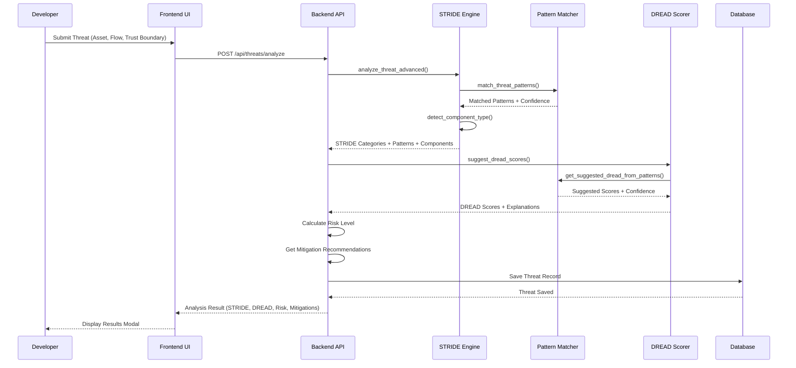
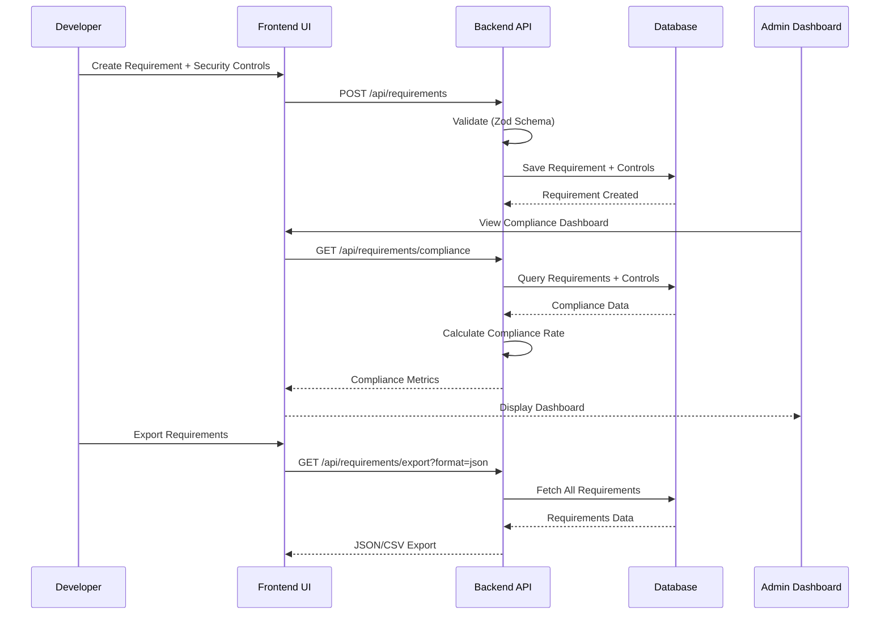
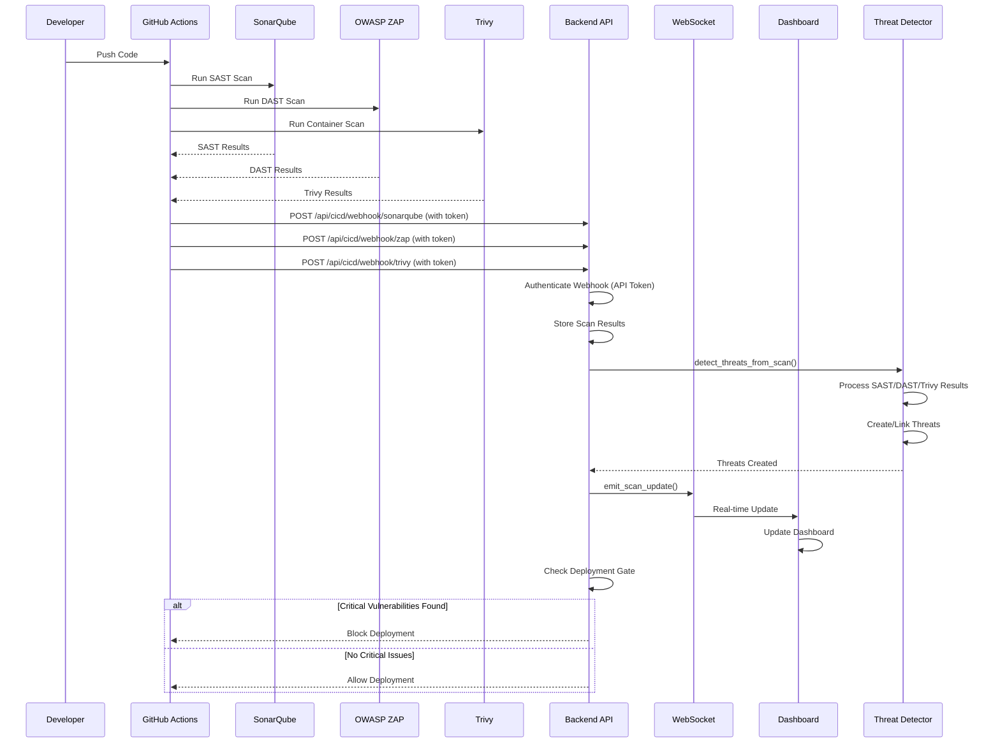
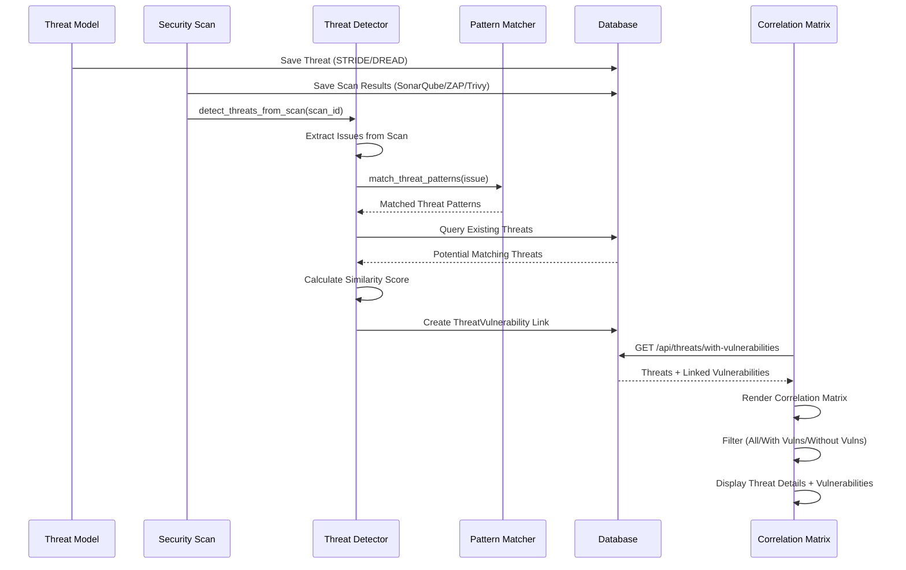
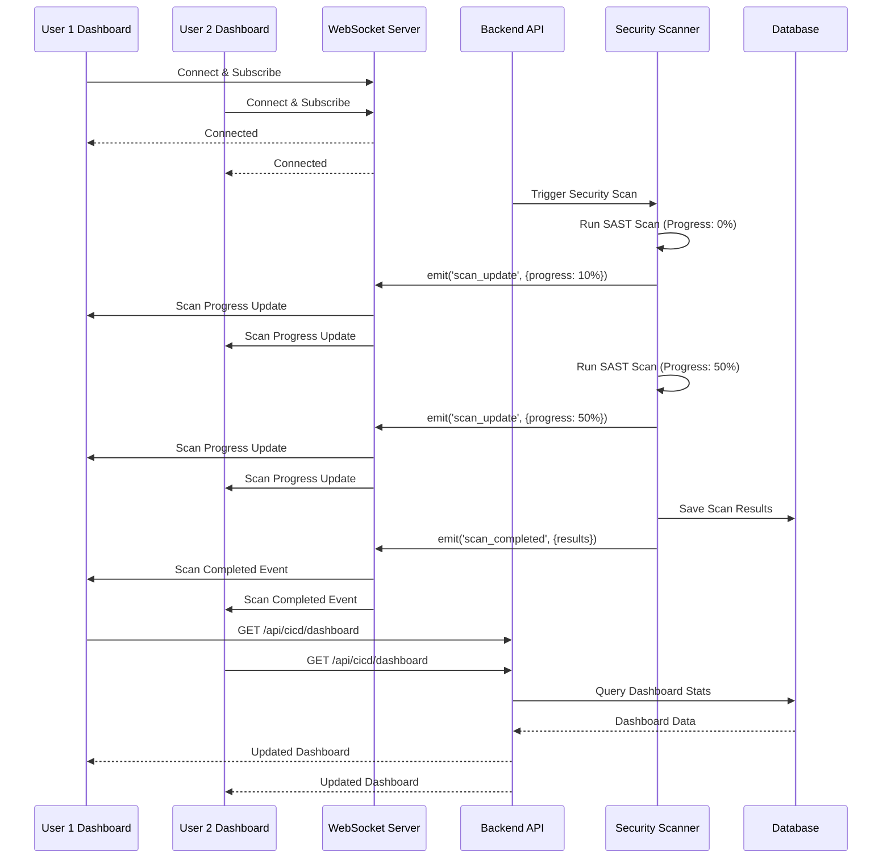
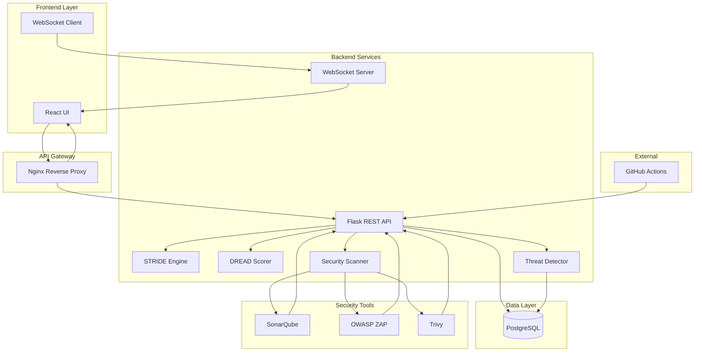

# Project Sentinel - Slide Content

## Slide 1: Core Concept - Security-by-Design Framework

### Title: Project Sentinel - Secure-by-Design DevSecOps Framework

**Key Concepts:**
- **Integrated Security**: Security embedded in every SDLC stage
- **Automated Threat Modeling**: STRIDE/DREAD methodology with pattern recognition
- **Requirements-Driven Security**: Enforced security controls mapping
- **Continuous Security Scanning**: SAST, DAST, and container scanning in CI/CD
- **Threat-Vulnerability Correlation**: Links theoretical threats to actual scan findings

**Core Philosophy:**
- Shift-left security: Identify threats before deployment
- Security requirements as first-class citizens
- Automated risk assessment with confidence indicators
- Real-time security visibility across the pipeline

---

## Slide 2: Threat Modeling Workflow - STRIDE/DREAD Analysis

### Title: Intelligent Threat Modeling with Automated Analysis

**Workflow Overview:**
1. **Input**: Developer describes asset, data flow, and trust boundaries
2. **STRIDE Analysis**: Pattern matching engine identifies threat categories
3. **DREAD Scoring**: Automated risk assessment with pattern-based suggestions
4. **Risk Calculation**: Automatic risk level assignment (High/Medium/Low)
5. **Mitigation Recommendations**: Context-aware security controls

**Key Features:**
- **14 Threat Patterns**: Pre-defined patterns covering OWASP Top 10
- **Component Detection**: Automatic identification of system components
- **Confidence Scoring**: Pattern matching with confidence indicators
- **Enhanced Mitigations**: Priority-ranked, component-specific recommendations

**Sequence Diagram:**

---

## Slide 3: Requirements Management Workflow

### Title: Security Requirements with Enforced Controls

**Workflow Overview:**
1. **Requirement Creation**: Define functional requirement with security controls
2. **Control Mapping**: One-to-one mapping of security controls to requirements
3. **OWASP ASVS Alignment**: Link controls to OWASP ASVS levels
4. **Compliance Tracking**: Admin dashboard for compliance auditing
5. **Export & Reporting**: Export requirements as CSV/JSON for audits

**Key Features:**
- **Enforced Controls**: Every requirement must have at least one security control
- **OWASP ASVS Integration**: Level 1, 2, 3 compliance tracking
- **Compliance Dashboard**: Real-time compliance rate calculation
- **Audit Trail**: Complete history of requirement changes

**Sequence Diagram:**

---

## Slide 4: CI/CD Security Scanning Workflow

### Title: Continuous Security Scanning in CI/CD Pipeline

**Workflow Overview:**
1. **Code Push**: Developer pushes code to repository
2. **GitHub Actions Trigger**: CI/CD pipeline automatically starts
3. **Parallel Security Scans**: SAST (SonarQube), DAST (ZAP), Container (Trivy)
4. **Results Aggregation**: Backend receives scan results via webhooks
5. **Deployment Gate**: Blocks deployment if critical vulnerabilities found
6. **Real-time Dashboard**: WebSocket updates show scan progress

**Key Features:**
- **Multi-Tool Integration**: SonarQube, OWASP ZAP, Trivy
- **Webhook Authentication**: API token-based secure webhooks
- **Automatic Threat Detection**: Scan findings auto-create threat records
- **Deployment Gates**: Configurable blocking rules based on severity

**Sequence Diagram:**

---

## Slide 5: Threat-Vulnerability Correlation

### Title: Bridging Theory and Reality - Threat-Vulnerability Correlation

**Workflow Overview:**
1. **Threat Modeling**: Create theoretical threats via STRIDE/DREAD
2. **Security Scanning**: CI/CD scans discover actual vulnerabilities
3. **Automatic Correlation**: Threat Detector service links scan findings to threats
4. **Visual Matrix**: Threat-Vulnerability correlation matrix visualization
5. **Risk Prioritization**: Focus on threats with confirmed vulnerabilities

**Key Features:**
- **Automatic Linking**: Pattern-based matching of scan findings to threats
- **Bidirectional View**: View threats with vulnerabilities or vulnerabilities with threats
- **Risk Assessment**: Distinguish theoretical vs. confirmed threats
- **Mitigation Tracking**: Track which threats have been addressed

**Sequence Diagram:**

---

## Slide 6: Real-time Dashboard & WebSocket Architecture

### Title: Real-time Security Visibility

**Workflow Overview:**
1. **WebSocket Connection**: Frontend establishes persistent connection
2. **Event Subscription**: Client subscribes to dashboard updates
3. **Scan Progress**: Real-time updates during security scans
4. **Result Notifications**: Instant notifications when scans complete
5. **Dashboard Refresh**: Automatic UI updates without page reload

**Key Features:**
- **Flask-SocketIO**: WebSocket server for real-time communication
- **Event-Driven Updates**: Scan progress, completion, and error events
- **Multi-Client Support**: Multiple users see updates simultaneously
- **Automatic Reconnection**: Handles connection drops gracefully

**Sequence Diagram:**

---

## Slide 7: System Architecture & Data Flow

### Title: Microservices Architecture with Security Integration

**Architecture Overview:**
- **Frontend**: React SPA with real-time WebSocket client
- **Backend**: Flask RESTful API with WebSocket server
- **Database**: PostgreSQL with JSONB for flexible data storage
- **Security Tools**: SonarQube, OWASP ZAP, Trivy (containerized)
- **Reverse Proxy**: Nginx routing frontend and API requests

**Data Flow:**
1. User interactions → Frontend → Backend API
2. Backend processes → Database persistence
3. Security scans → External tools → Webhook callbacks
4. Real-time updates → WebSocket → Frontend UI

**Key Design Patterns:**
- **Service Layer**: Business logic separated from API endpoints
- **Pattern Matching**: Reusable threat pattern library
- **Event-Driven**: WebSocket events for real-time updates
- **Webhook Authentication**: API token-based security

**Architecture Diagram:**

---

## Slide 8: Key Innovations & Value Proposition

### Title: What Makes Project Sentinel Unique

**Key Innovations:**

1. **Intelligent Pattern Recognition**
   - 14 pre-defined threat patterns
   - Regex-based matching with confidence scores
   - Component-aware threat detection
   - Automatic STRIDE category assignment

2. **Automated DREAD Scoring**
   - Pattern-based score suggestions
   - Context-aware adjustments
   - Confidence indicators for each score
   - Manual override capability

3. **Threat-Vulnerability Bridge**
   - Automatic linking of scan findings to threats
   - Distinguishes theoretical vs. confirmed threats
   - Visual correlation matrix
   - Risk prioritization based on real findings

4. **Requirements-Driven Security**
   - Enforced security controls mapping
   - OWASP ASVS compliance tracking
   - Audit-ready exports
   - Compliance dashboard

5. **Real-time Security Visibility**
   - WebSocket-based live updates
   - Scan progress tracking
   - Instant result notifications
   - Multi-user synchronized views

**Value Proposition:**
- **Shift-Left Security**: Identify threats before deployment
- **Automated Risk Assessment**: Reduce manual effort in threat modeling
- **Continuous Security**: Integrated scanning in CI/CD pipeline
- **Compliance Ready**: OWASP ASVS alignment and audit trails
- **Developer-Friendly**: Intuitive UI with real-time feedback

**Impact:**
- Faster threat identification
- Reduced security debt
- Improved compliance posture
- Better risk prioritization
- Enhanced developer security awareness

---
